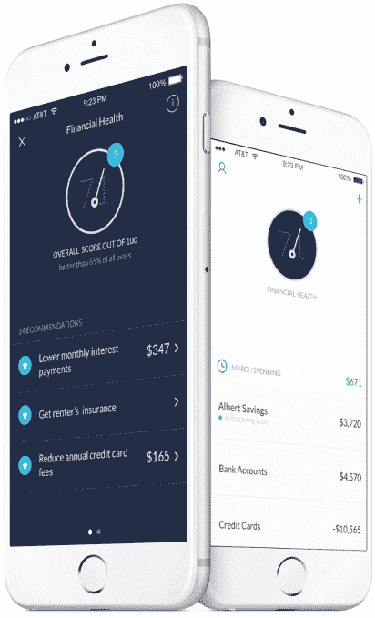

# Albert 为其帮助您省钱的财务应用筹集了 250 万美元 

> 原文：<https://web.archive.org/web/https://techcrunch.com/2016/11/23/albert-raises-2-5-million-for-its-finance-app-that-helps-you-save-money/?utm_campaign=FinTech%2BFeed&utm_medium=web&utm_source=FinTech_Feed_23>

每个人都知道如何改善财务健康的基本原则:存钱，跟踪你的支出，减少你的债务，寻找节省每月账单的方法，进行明智的投资。人们努力将这些知识转化为你今天可以采取的具体行动。这就是一个名为 [Albert](https://web.archive.org/web/20221209215015/https://meetalbert.com/) 的应用程序介入帮助的地方。这家初创公司现在已经获得了 250 万美元的种子资金，它提供了一种简单的方法来跟踪你的财务状况，并提供旨在提高你整体财务状况的个性化建议。

这笔资金来自 Bessemer Ventures Partners、CFSI(金融服务创新中心)、500 Startups 和 500 Fintech 等。这款应用在今年夏天早些时候发布后不久就上市了。

艾伯特是由以前的大学朋友 Yinon Ravid 和 Andrzej Baraniak 共同创立的，他们之前都在金融服务行业工作。

Albert 主要面向年轻的移动用户，它不是 Simple 那样的移动银行应用。如果有什么不同的话，它的运作更像 Mint，从这个意义上说，它将你的财务数据聚集到一个单一的目的地，包括银行账户、信用卡、房地产、贷款和投资。

它与 Mint 等服务的不同之处在于，它更专注于提供财务建议，鼓励你做出改变，同时还帮助你跟踪你的日常支出和预算。

当它提供建议时，它会推动你真正付诸行动。

例如，艾伯特可能建议你需要开一个储蓄账户。

Ravid 解释说:“20 岁到 40 岁之间的绝大多数人实际上并不存钱，他们实际上在过去三个月里花的比他们挣的还多。”“因此，我们给出的第一条建议是，存几美元来增加你的应急基金。”

然后，艾伯特通过自动从你的银行艾伯特储蓄银行转账来帮助你启动这笔基金，艾伯特储蓄银行是 FDIC 保险的储蓄账户，直接存在于应用程序中。

更广泛的金融科技领域的其他几个移动应用也实现了这种财务自动化的想法，如储蓄应用 Digit 或 Qapital 以及投资应用 Stash Invest 和 Acorns。与此同时，在提供你财务状况的鸟瞰图方面，艾伯特面临着 Level Money 或 Prosper Daily 这样的应用。还有一些，像 LearnVest，旨在通过提供个人建议来教你如何掌控自己的财务。

然而，艾伯特把所有这些概念放入一个单一的目的地。

除了帮助你存钱，艾伯特还会建议你申请低息贷款来偿还信用卡债务，通过更换保险公司来减少你的汽车保险费，或者进行投资。

[gallery ids="1420076，1420074，1420072"]

为了提供这些建议，艾伯特与合作伙伴一起工作——这也是它赚钱的方式。该公司与将提供贷款报价的贷款机构有关系，同时它向 Betterment 提供投资建议，并与 CoverHound 合作提供保险报价。艾伯特从这些推荐中获得收入，这是它保持其应用程序对消费者免费的方式。

Ravid 指出，虽然这也意味着 Albert 在提供建议方面外包了很多繁重的工作，但这有助于保持其建议的公正性。

“我们认为，在向人们提供建议和改善他们的财务健康状况方面，非常重要的一点是保持客观，与我们推荐的服务保持一定距离，”他表示。

除了建议之外，当你的钱发生重要事情时，艾伯特也会通知你——比如你收到了透支费，或者账单要到期了。它有各种各样的工具，让你可以查看你的支出、账单和收入，给用户一个定期与应用程序互动的理由，即使他们已经根据艾伯特的建议采取了行动。

Ravid 不愿谈论 Albert 有多少用户，但它的应用程序现在在 iTunes 应用程序商店的金融类中排名第 84 位，苹果最近几天经常在那里展示它。这位联合创始人会说，艾伯特跟踪的数据量正在增长，现在它跟踪超过 5000 万笔交易。

这家总部位于洛杉矶的初创公司是一个四人团队，最近在计划在 Android 上发布之前，推出了其应用程序的 2.0 版本。该应用程序是在应用商店上免费下载的。