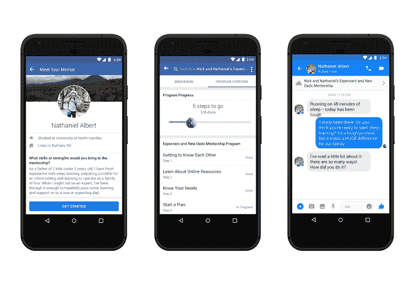

# 脸书推出导师计划，将团队中的人配对，帮助他们相互指导 

> 原文：<https://web.archive.org/web/https://techcrunch.com/2018/08/09/facebook-launches-mentorships-matching-people-within-groups-to-help-them-guide-each-other/?utm_campaign=Revue%20newsletter&utm_medium=Newsletter&utm_source=The%20Interface>

脸书——因其在社交媒体平台上帮助传播错误信息而受到抨击——已经将注意力转向其工具的更积极的应用，例如加强[社区](https://web.archive.org/web/20221005230131/https://techcrunch.com/2018/02/09/facebook-community-grants/)、[慈善筹款](https://web.archive.org/web/20221005230131/https://techcrunch.com/2018/04/27/facebook-drops-fundraising-fees-for-personal-causes/)，甚至可能找到[的那个](https://web.archive.org/web/20221005230131/http://techcrunch.com/2018/08/03/facebook-dating-feature/)。今天是这份名单中的最新成员:该公司今天宣布正式推出 Mentorships，这是一项免费服务，将需要帮助或指导的人与能够提供帮助或指导的人配对。

导师计划将首先关注特定群体中的指导机会。这本身就是一个相当大的机会，整个社交网络总共有大约 2 亿群成员。脸书的团体产品经理 Gabriel Cohen 说，在更广泛地邀请参与者之前，脸书将把这一功能扩展到小范围的团体。

指导功能的用户必须至少年满 18 岁。

当我们第一次发现脸书在近一年前测试导师服务时，我们猜测这将是一项专注于职业发展的服务，因为它是在脸书进军工作列表和 LinkedIn 推出自己的导师服务后不久推出的。事实证明，这项服务的早期试验是在脸书的社会公益论坛上宣布的，最初的用户是 iMentor，一个专注于第一代大学生的指导小组，以及国际救援委员会。

随着导师制服务发展成为一种更广泛可用的模式，脸书最初将专注于后一种社会公益角度——为有需要的人或出于教育目的提供指导，而不是直接的职业辅导。

导师功能的早期用户包括 [Mama Dragons](https://web.archive.org/web/20221005230131/https://www.facebook.com/mamadragons/) ，一个专注于为 LGBTQIA 孩子的摩门教父母提供支持的团体；还有一个小组专注于[学习如何制作肥皂](https://web.archive.org/web/20221005230131/https://www.facebook.com/groups/881719151947634/)。(对，肥皂。)导师产品经理加布里埃尔·科恩(Gabriel Cohen)表示，导师们将提供的帮助种类会有很大不同，从帮助新成员在团队中“学习诀窍”，到在任何特定领域提供更直接的支持和指导。

目前，这项服务还不涉及支付。科恩在接受采访时说:“人们这样做是出于志愿精神。

有趣的是，在第一次迭代中，脸书不仅针对特定的小组，而且针对小组管理员来管理和运行导师制。也就是说，由小组管理员决定他们是否愿意在他们的社区内启用导师制度，然后也由他们将人们配对，并进行介绍。此后，他们可以通过脸书建立的引导程序进行交流——该程序提供了一些关于如何进行和相互检查的指导——或者直接通过 Messenger 进行交流。在这两种情况下，导师和学员之间的对话都是完全私密的。

科恩说，在与那些尝试导师功能的人的早期对话中，到目前为止，管理员似乎对做繁重的工作没什么意见，尽管随着时间的推移，有一些反馈表明脸书提供了更多的工具来帮助事情发展，无论是提供一些配对建议还是简单地帮助以更自动化的方式连接用户。

“我们依靠他们来进行这些匹配，但我认为有机会简化他们需要做出的努力，”他说。“维护好一个社区需要做很多工作，我们不想给他们增加负担。”

但你可以明白为什么脸书会走这条更加人工化的路线，至少在一开始是这样:在如何使用算法来管理和促进其平台上的交流方面，该公司一直在走钢丝。当涉及到新闻等其他领域时，其中一些并没有对其有利，该公司已经采取了重大举措，让更多的人参与进来，以纠正错误。现在引入算法可能是一个不值得犯的错误，特别是因为这种风气应该是直接连接人们。

科恩说，随着时间的推移，这一想法将扩展到更多的领域——基本上与平台上的群体一样多。这些不仅包括养育子女和制作肥皂，还包括健身、支持暴力或其他灾难的幸存者团体等等。

是的，他也不排除让导师出现在脸书的工作列表中。

“如果我们想在我们的直接关系网之外找工作，导师真的能帮上忙，”他说。“我们确实想在未来利用这一点。乔布斯似乎是一个拥有这些东西的合理地方。”