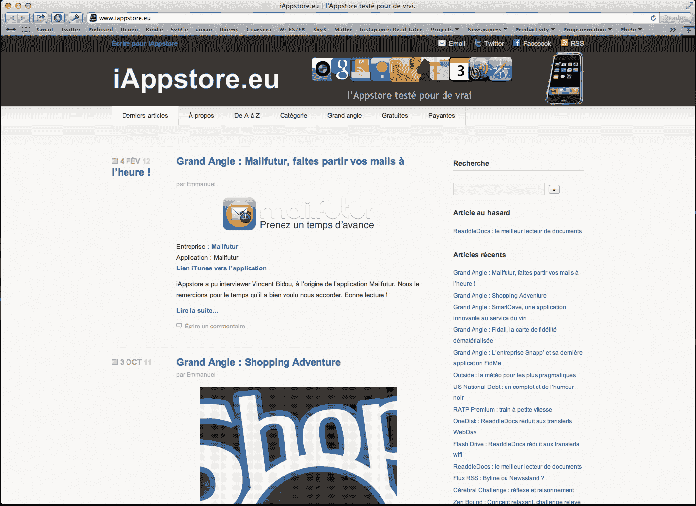

# 苹果将 App Store 代销商佣金从 7%下调至 2.5%

> 原文：<https://web.archive.org/web/https://techcrunch.com/2017/04/24/apple-cuts-app-store-affiliate-commission-from-7-to-25/?utm_campaign=The%20Exponential%20View&utm_medium=email&utm_source=Revue%20newsletter>

苹果公司刚刚向 [App Store 附属计划](https://web.archive.org/web/20221210033651/https://www.apple.com/itunes/affiliates/)的成员发送了一封电子邮件，称 App Store 佣金将于 5 月 1 日从 7%降至 2.5%——降幅为 64%。虽然这一变化对 App Store 用户没有影响，但它对 App Store 生态系统有一些影响。

Apple 社区的许多网站链接到 App Store 下载，链接中有一个唯一的推荐 ID。当客户使用这个链接购买应用程序或应用内购买时，苹果会向其附属合作伙伴返还一小部分。开发人员仍然获得 70%的销售额，而合作伙伴得到奖励。

对于一个 1 美元的应用程序来说，这种会员佣金只是几分钱。但是，如果你已经建立了一个严肃的观众群，它可以累加起来。我知道这一点，因为我自己也经历过。

回到 2009 年，当 App Store 刚刚成立几个月的时候，我和我的一个朋友(我知道，这是一个可怕的名字)一起创办了一个名为 iAppstore.eu 的网站。这是一个目录，里面有关于某个特定事物的最佳应用的推荐。它不是特别原创，但我们认为人们可以通过查看我们的推荐来节省时间和金钱，因为大多数有趣的应用程序都是付费下载的。

iPhone 又慢又重，App Store 是一个全新的事物。但它很迷人。苹果一夜之间创造了一个全新的竞技场。当时没有 Instagram、Snapchat、WhatsApp 或优步。独立开发者仍在尝试，一半的应用程序以这样或那样的方式被破坏，应用商店是一个很小的地方。

我们的小网站每月有大约 15000 名读者。在最初的几个月里，通过应用商店的佣金和页面底部的谷歌广告，我们赚了几百欧元。这不是什么开创性的东西，但作为一个不想在暑假工作的孩子来说，这是一个有趣的赚钱的小方法。这可能就是我如何得知你可以在互联网上赚钱，并最终在几年后申请了 TechCrunch。

很快，更大的网站开始认真对待应用商店评论，应用价格大幅下降，我们的网站逐渐消失。我不认为应用商店的佣金是一个好的商业模式，我很高兴我没有在这个行业呆太久，但仍然有很多大大小小的网站依赖这些佣金。

如果苹果大幅削减这一收入流，该公司最终可能会疏远为这些网站写作的人。但这也可能表明，一些更大的应用商店变化即将到来。

