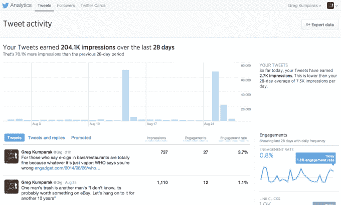

# Twitter 向所有人开放其分析仪表板

> 原文：<https://web.archive.org/web/https://techcrunch.com/2014/08/27/how-many-people-see-your-tweets-twitter-opens-its-nifty-analytics-dashboard-to-everyone/?utm_campaign=fb&ncid=fb>

# 有多少人看到你的推文？Twitter 向所有人开放其漂亮的分析仪表板

早在 7 月，Twitter 推出了一个非常漂亮的分析仪表板。有点像谷歌推文分析，它允许你评估你发送的每条推文的性能。有多少人看到了？有多少人真的点击了你的链接？

不过，有一个条件:它只对广告商和认证用户开放。

不再！现在，你也可以对你发送的每条推文的性能过于着迷了！*万岁！*

这一变化的消息来自 Twitter 前端工程师 Ian Chan:

而[潜伏在 Twitter 支持基础中的这个页面](https://web.archive.org/web/20221207043858/https://support.twitter.com/articles/20171990)证实了这一点:仪表板现在应该对所有已经开放至少 14 天、没有被限制/保护/暂停，并且(奇怪的是)主要用英语、法语、日语或西班牙语发布推文的账户开放。

你可以在这里找到新解锁的分析面板。

