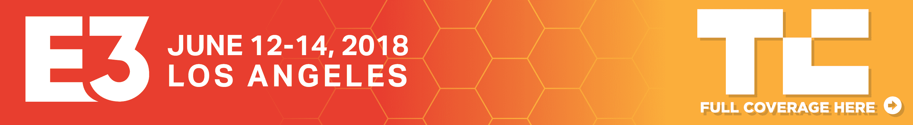

# 微软收购了一大批游戏工作室 

> 原文：<https://web.archive.org/web/https://techcrunch.com/2018/06/10/microsoft-acquires-a-whole-bunch-of-game-studios/?utm_campaign=microsoft-acquires-a-whole-bunch-of-game-studios&utm_medium=social_link&utm_source=missinglettr>

# 微软收购了一大堆游戏工作室

微软在 Xbox E3 新闻发布会上继续发布游戏公告，宣布了一系列工作室收购，旨在加强游戏机制造商的原创游戏内容。

Xbox 负责人菲尔·斯潘塞周日宣布，微软已经收购了忍者理论、游乐场游戏、亡灵实验室和强迫游戏。这四家工作室将增加微软在第一方游戏开发中的相当大的分量，特别是在该公司寻求加强其游戏下载订阅服务 Xbox Game Pass 的时候。

始于 2010 年的 Playground Games 是 Forza racing 系列背后的开发商，也是 Xbox 的长期合作伙伴。在宣布合作的同时，该系列的新游戏《极限地平线 4》也发布了。

《忍者理论》设计了包括《地狱之刃》在内的游戏，《不死实验室》发布了《衰败状态》系列，而《强迫游戏》正在开发将于今年推出的新游戏《我们快乐少数》。

新的工作室将全部以微软工作室的品牌存在，旁边是一个新的合资企业，名为倡议，由前晶体动力工作室负责人达雷尔·加拉格尔领导。微软工作室已经包含了光环制造商 343 Industries 和《我的世界》背后的团队，后者在 2014 年被微软以 25 亿美元收购。

