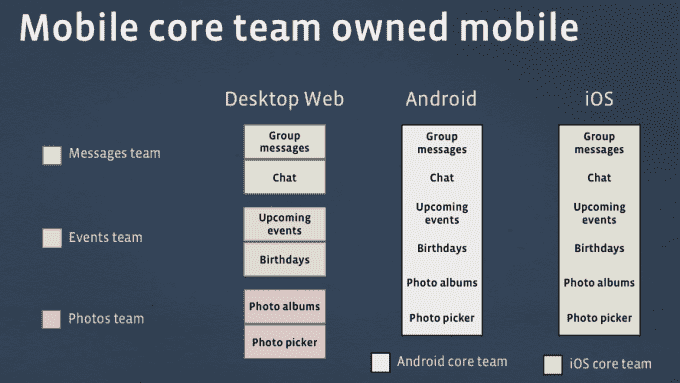
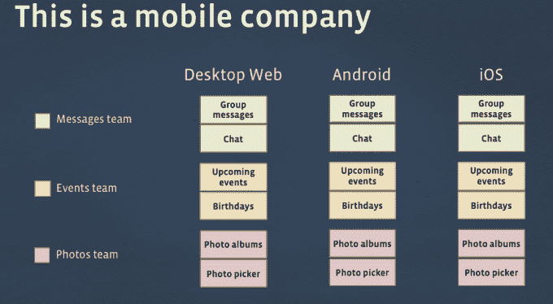

# React 拆除了工程筒仓，因此脸书可以为 Web、iOS 和 Android 重用代码 

> 原文：<https://web.archive.org/web/https://techcrunch.com/2015/08/26/facebook-react-native/?utm_content=buffer23a1c&utm_medium=social&utm_source=twitter.com&utm_campaign=buffer>

本来要花 18 个月的。但有了 React Native，脸书用了 5 个月就开发出了 iOS [Ads Manager](https://web.archive.org/web/20221007031234/https://www.facebook.com/business/news/ads-manager-app) 应用，然后只用了 3 个多月就移植到了 Android 上。这是因为 React Native 让脸书的工程师工作更快，并重用 JavaScript 后端。

程序员们梦想有一个系统能让他们“写一次，在任何地方运行”。但是脸书工程经理汤姆·奥奇诺说这些应用程序的性能“感觉糟透了”。相反，他说机会是“学会用 React 构建用户界面，然后你可以在任何地方编写你的应用程序。”

[React](https://web.archive.org/web/20221007031234/https://code.facebook.com/projects/176988925806765/react/) 和 React Native 是帮助脸书更快建立网站和移动应用的两个工具。React 是一个强大的 web 应用 JavaScript 框架。React Native 允许开发人员使用熟悉的 JavaScript 语言构建本地移动应用程序，同时以高性能的本地组件显示用户界面。

脸书开源的 [React 在 2013 年](https://web.archive.org/web/20221007031234/https://code.facebook.com/projects/176988925806765/react/)和 [React Native](https://web.archive.org/web/20221007031234/https://code.facebook.com/projects/450791118411445/react-native/) 在今年早些时候的 [F8 会议](https://web.archive.org/web/20221007031234/https://beta.techcrunch.com/2015/03/26/facebook-open-sources-react-native/)上。这有助于 it 部门获得大量关于如何改进工具的反馈。但是现在脸书更形象地公开了这些技术对其业务的重要性。奥奇诺和脸书工程总监亚当·沃尔夫(Adam Wolff)今天对一群记者发表了讲话，沃尔夫是一家名为 Sharegrove 的公司的联合创始人，脸书在 2010 年收购了这家公司，以建立 React。

首先，Wolff 简单介绍了一下脸书移动工程的历史。2011 年的事情是一场灾难。脸书成长为一家纯网络公司，经常重复和测试新功能。但是追求速度成了马克·扎克伯格所说的脸书“最大的错误”

移动应用基于 html 5——一种混合的本地基础设施，包裹着从其网站上提取的内容。这使得更新变得很快，因为脸书可以编写一个移动网络代码库，并轻松地将其包装在 iOS 或 Android 中。但这种 HTML5 格式导致了用户讨厌的极其缓慢的移动应用。

最终在 2012 年，马克·扎克伯格宣布该公司将首先转向移动业务。整个 iOS 和 Android 团队被设计来彻底检查代码，当脸书重新发布其完全适用于 iOS 和 Android 的原生应用程序时，[速度大幅提升，用户满意度也大幅提升。](https://web.archive.org/web/20221007031234/https://beta.techcrunch.com/2012/12/13/facebook-android-faster/)

但是，移动团队仍然是孤立的。因此，脸书再次改变了工程结构，投入巨资在一个大型移动操作系统中培训大部分工程人员，并将移动工程师嵌入每个产品团队，如照片或事件。

Wolff 承认这“减缓了开发”，因为工程师必须学习这些新的移动媒体，而且因为设备和原生应用程序的限制，为移动设备构建自然需要更长的时间。但是受益的是用户。原生应用程序更难制作，但它们可以更快、更炫，而无需使用更多的手机计算和能源资源。

现在有了 React 和 React Native，脸书的 web、iOS 和 Android 工程团队之间的隔阂正在消失，构建优秀应用程序的障碍也在消失。一旦工程师知道如何用 JavaScript 为 React 编写代码，他们就可以轻松地为任何主流平台编写应用程序。

接下来，脸书正在开发另外两个工具，名为 [Relay](https://web.archive.org/web/20221007031234/https://facebook.github.io/relay/) 和 [Flow](https://web.archive.org/web/20221007031234/https://code.facebook.com/posts/1505962329687926/flow-a-new-static-type-checker-for-javascript/) ，这两个工具将允许它仍然使用 JavaScript 后端并做出反应，但同时获得一些更现代的编码语言的灵活性和生产力优势。Occhino 总结道:“开发者在网络上可以走得很快，我们正试图通过 React Native 挽回一些损失。”