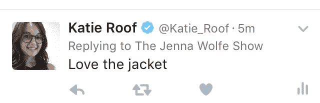

# Twitter 终于在测试 TechCrunch 中停止将用户名计入回复字符限制

> 原文：<https://web.archive.org/web/https://techcrunch.com/2016/10/26/sinking-the-twitter-canoe/?utm_content=buffer2652f&utm_medium=social&utm_source=twitter.com&utm_campaign=buffer>

# Twitter 终于在测试中停止将用户名计入回复字符限制

#Beyond140 即将取得成果，它废除了 Twitter 最令人讨厌的法律之一。一些 iOS 用户现在是一个测试组的一部分，该测试组不再看到收件人的用户名出现，或者在他们发布回复时计入 140 个字符的限制。这为实际讨论留下了更多的空间。

它还防止了可怕的“Twitter 独木舟”，越来越多的用户加入回复线程，直到几乎没有任何字符可用，对话中断。

Twitter 的一位发言人向 TechCrunch 证实，这是一个向用户子集显示的测试，指的是一篇 [Twitter Help](https://web.archive.org/web/20221007041806/https://support.twitter.com/articles/20175008) 文章称，它最终将开始向用户显示这些。现在，测试正在实际用户中进行，最终将以某种形式推广到每个人，尽管 Twitter 没有透露具体时间。

Twitter [在五月](https://web.archive.org/web/20221007041806/https://blog.twitter.com/express-even-more-in-140-characters)宣布改变最终会实现。它已经实现了#Beyond140 的一些其他更新，包括转发自己和照片等媒体附件的能力，不计入字符限制。

然而，在宣布的时候，Twitter 只是说用户名不算数——并不是说它们不会出现。对于 Twitter 的长期用户来说，这代表着一个时代的结束。@ reply 是 Twitter 交流的一个标志，被许多平台复制，包括 Slack。

在 change its 测试中，回复从一个空的文本框开始，上面只有一点灰色的“回复 Josh Constine 和其他人”,链接着“其他人”。这可能会让一些用户误以为他们在撰写推文，而不是回复。如果你忘记了，点击灰色文本中的“其他人”链接会显示出你在回复谁，并允许你添加和删除收件人。

左起:1。用户名会从回复中删除，所以灰色的小文字会显示你在回复谁。2.回复在时间线中的显示方式。3.对于群组回复，轻按撰写器中的“其他人”链接来切换回复中包括的人

这是推特的关键时刻。据报道，在开始接受收购出价后，谷歌和迪士尼等许多潜在买家退出了。明天它将宣布其季度收益，但是[将收益发布时间从传统的太平洋时间下午 4 点移到了太平洋时间凌晨 4 点，那时许多记者可能已经睡着了。如果收益疲软，这可能会限制或至少推迟负面新闻。](https://web.archive.org/web/20221007041806/https://beta.techcrunch.com/2016/10/24/twitter-decides-to-release-earnings-while-most-of-us-are-sleeping-because-reasons/)

虽然 Twitter 的产品在其 3.13 亿月度活跃用户中拥有大量忠实的铁杆用户，但其背后的公司却陷入了领导力、增长和收入困境。简化回复并在平台上引发更深入的讨论，可以让新用户更容易接触到它，对长期推特用户来说也更重要。