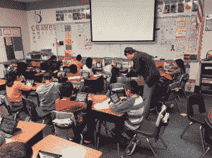

# Nearpod 筹集 920 万美元帮助教师使用技术进行现场教学 

> 原文：<https://web.archive.org/web/http://techcrunch.com/2016/05/09/nearpod-raises-9-2-million-to-help-teachers-use-tech-for-live-instruction/?utm_content=buffer2d078&utm_medium=social&utm_source=twitter.com&utm_campaign=buffer>

如果 Nearpod 的首席执行官[圭多·科瓦尔斯基](https://web.archive.org/web/20230129055915/https://www.crunchbase.com/person/guido-kovalskys)如愿以偿，那么高射投影仪和 PowerPoint 演示将再也不会让学生感到无聊。相反，他希望看到尖端技术和互动内容成为教学行业的标准工具。

为此，Nearpod 在由 [Reach Capital](https://web.archive.org/web/20230129055915/http://reachcap.com/) 牵头的首轮融资中筹集了 920 万美元，以帮助教师使用移动技术进行现场教学，而不是告诉他们的学生放下手机。

Kovalskys 说，“美国 70%到 80%的高中生都有自己的智能手机。40%的学生仅通过学校项目就能在课堂上接触到移动设备。”

Nearpod 的应用程序允许教师在课堂上通过移动设备向学生讲授数字课程。

首先，教师在 Nearpod 内容市场上注册并选择各种各样的数字课程。然后，他们给学生分配一堂数字课，学生通过 Nearpod 上的学生帐户参与课堂教学。

这些课程通常感觉像互动故事、项目或手机游戏。但是他们给了老师一个关于学生对特定主题的掌握或挣扎的观点。

给予教师在课堂上进行实时评估的权力，有助于他们选择如何集中与学生相处的有限时间，以及接下来向学生逐个或集体展示什么内容。

*教师在课堂上使用 Nearpod 向学生的移动设备传送数字课程。*

出于隐私考虑，Nearpod 不会存储学生的数据以供长期分析。

该公司报告称，Nearpod 应用程序上已经有 160 万个账户，其中大部分是学生账户，但在 2016 年，1 万所学校中至少有 10 万名教师使用了 Nearpod 平台。

大约有 2000 所学校从 Nearpod 的“免费增值”版本转换为初创公司的付费高级版本。

Premium Nearpod 让教育工作者能够访问更多现成的数字课程。否则，他们将不得不为免费目录之外的商品付费，按菜单点菜。Nearpod 的高级版本还允许教师创建和存储更多或更强大的课程。

Kovalskys 表示，Nearpod 自 2013 年以来一直在创收。他说，它为招聘筹集了一轮资金，并在美国约 125，000 所 K-12 学校中的更多学校中落地其技术。

Reach Capital 的詹妮弗·卡罗兰(Jennifer Carrolan)是 Nearpod 的董事会成员，她说她支持该公司，因为它根据每个学生的需求来区分或定制教学，还因为它包括而不是取代人。

“太多的教育技术工具假设学生将通过坐在电脑前与内容互动来学习，而不是从教育者或同龄人那里学习。这位投资者说:“Nearpod 认为教室远不止于此，它是一个动态的环境，孩子们在与同龄人和老师的对话中学习。”。

这位首席执行官表示，Nearpod 一直在开发新的课程，供浏览器、智能手机和平板电脑使用，但它对 3D 图像和虚拟现实内容越来越感兴趣，例如，这些内容可以让学生虚拟练习心脏手术或编辑 DNA 链。

除了 Reach Capital， [Nearpod](https://web.archive.org/web/20230129055915/https://www.crunchbase.com/organization/nearpod) 的 A 轮投资者还包括:暴风创投；罗森堡风险投资公司；AGP 迈阿密；阿森纳风险投资伙伴；约翰和詹姆斯·奈特基金会；Krillion Ventures 斯坦福大学的 StartX 基金，还有一些倡导教育的天使投资人，包括马克·贝尼奥夫。