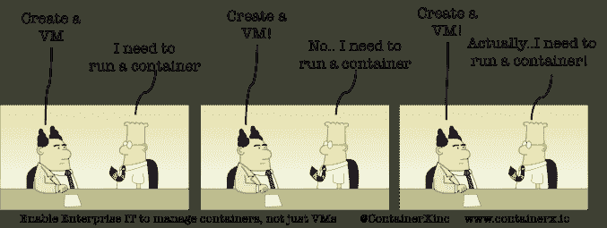

# 让我们定义一下“原生容器”

> 原文：<https://web.archive.org/web/https://techcrunch.com/2016/04/27/lets-define-container-native/?utm_content=buffer6bb8d&utm_medium=social&utm_source=twitter.com&utm_campaign=buffer>

Salil desh pande撰稿人

Salil Deshpande 是

[Bain Capital Ventures.](https://web.archive.org/web/20221209070738/http://www.baincapital.com/)

他专注于基础设施软件和开源。

More posts by this contributor

**随着容器在各种各样的用例中流行起来，企业家和基础设施软件投资者开始关注围绕容器的机器投资。但是有一个特殊的概念正在出现，它需要一个名字。今天我提议我们开始使用术语 *容器本地* 来指代这个概念。**

 **我研究(谷歌)了这个术语，以了解它今天是如何被使用的。原来它是指在裸机上(而不是在虚拟机上)运行容器的想法。

多么狭隘地使用一个美丽的术语！容器原生应该有一个新的定义，旨在更好地代表容器对软件开发和操作的影响程度。

**con tain er na tive**

kənˈtānər/ˇnādiv/

*形容词*

1.  将 *容器* 视为基础设施一级单位的软件(例如，相对于将 *物理机* 或 *虚拟机* 视为一级单位)
2.  不只是在容器中、容器上或容器周围“碰巧工作”的软件，而是专门为容器设计的软件

**向容器本地计算的转变是一代人一次的转变。**

就像其他一代人一次的转变一样，传统玩家很少以有意义的方式进行转变。发生这种情况有几个原因:(a)他们不了解这种转变的规模或意义，或者(b)他们了解这种转变，但却坚持销售错误的架构，并有动机在向市场传递信息时将新架构的某些方面视为复选框项目，或者(c)他们对早期的过度宣传感到恼火或失望。

为了从各种角度说明 container-native 的含义，这里有几个快速示例:(I)打包，(ii)持续集成和部署，(iii)应用生命周期管理(ALM)，(iv)排队和 lambda 架构，(v)监控，以及(vi)安全性。

**包装**

[【乔贝达】](https://web.archive.org/web/20221209070738/https://www.linkedin.com/in/jbeda) (以前是谷歌的，现在是 EIR 的[Accel](https://web.archive.org/web/20221209070738/http://www.geekwire.com/2015/accel-partners-hires-leading-google-engineer-joe-beda-as-a-seattle-based-entrepreneur-in-residence/)，以及[shipped](https://web.archive.org/web/20221209070738/https://shippable.com/)和[CoreOS](https://web.archive.org/web/20221209070738/http://coreos.com/))[认为](https://web.archive.org/web/20221209070738/https://www.eightypercent.net/post/new-container-image-format.html) 容器社区已经非常重视环境 [Kubernetes](https://web.archive.org/web/20221209070738/http://kubernetes.io/)[meso sphere](https://web.archive.org/web/20221209070738/https://mesosphere.com/)等)，但在工具上还不足以更好地理解容器本身内部发生的事情。 他提出了以下具体问题:

*   **无包自省** 。当下一个安全问题出现时，很难轻易看出哪些图像是易受攻击的。此外，很难编写自动策略来阻止这些映像运行。
*   **不容易共享的包** 。如果[两个]映像安装了同一个包，则该包的位会被下载两次。用户构造复杂的“继承”链来帮助解决这个问题并不罕见。
*   **无手术包更新** 。更新包需要重新创建映像，并重新运行 Dockerfile 文件中的所有下游操作。如果用户能够很好地跟踪哪个源进入哪个图像，那么应该可以只更新包，但是这很困难并且容易出错。
*   **订单相关图像构建** 。Order 文件中的顺序很重要——即使不是必须如此。通常情况下，两个动作之间没有任何互动。但是 Docker 无法知道，所以必须假设每个动作都依赖于所有前面的动作。
*   **包经理 cruft** 。

他接着建议了几个局部解决方案，但根本原因是我们的包装基础设施不是 *集装箱——原生* 。

**开发运维:持续集成(CI)、持续部署(CD)、应用生命周期管理(ALM)**

让我们关注 CI、CD 和 ALM 中的容器原生方法。诸如 [不可变容器](https://web.archive.org/web/20221209070738/https://medium.com/adopting-microservices-architecture/after-docker-unikernels-and-immutable-infrastructure-93d5a91c849e) 之类的方法改变了你对使用容器的系统的看法:

不可变服务器是一种部署模型，要求生产系统上不发生应用程序更新、安全补丁或配置更改。如果需要修改这些层中的任何一层，就会构建一个新的映像，并将其推入生产环境。这种方法的优点包括对生产中运行的代码更有信心，将测试集成到部署工作流中，可验证系统没有受到损害。

一旦您成为不可变服务器概念的信徒，那么部署速度和最小化漏洞表面积就成了目标。容器促进了每个容器单一服务(微服务)的思想，而 unikernels 更进一步地发展了这一思想。

如 [Nirmata](https://web.archive.org/web/20221209070738/http://nirmata.com/) 和 Mesosphere(带 [速度](https://web.archive.org/web/20221209070738/http://thenewstack.io/coreos-introduces-container-scanning-for-vulnerabilities/) )等公司一直在推送类似消息；请注意，容器正在为 DevOps 改变最佳实践，这反映了对 *容器-本机* 而非通用工具的需求:

“[容器]需要新的工具来自动化和管理应用程序。”

**工作流处理和编排**

容器也使得无服务器计算&微服务架构日益突出。红杉 [的 Matt Miller 最近写道](https://web.archive.org/web/20221209070738/https://www.sequoiacap.com/article/build-us-microservices/) 容器已经“为所有服务创建了一个标准化的框架”，并且已经成为微服务架构的核心构建块。

将组件分离为独立功能和服务的能力从根本上改变了架构师对应用和数据中心组合的思考方式，进而改变了作业和任务处理方式。

随着平台的转移，一些有先见之明的公司已经采用了容器原生方法来处理工作和工作流。值得注意的是，亚马逊网络服务的[λ](https://web.archive.org/web/20221209070738/https://aws.amazon.com/lambda/)框架用于无服务器计算。

像 [Iron.io](https://web.archive.org/web/20221209070738/https://www.iron.io/) (披露:贝恩资本是投资者)这样的公司同样接受了这一愿景，并利用 container-native[workflow processing](https://web.archive.org/web/20221209070738/https://www.iron.io/platform/)with Go 和[micro-containers](https://web.archive.org/web/20221209070738/https://www.iron.io/microcontainers-tiny-portable-containers/)来提供企业解决方案，以便在任何云或内部可靠地扩展以容器为中心的作业。

**安全&监控**

毫不奇怪，随着容器投入生产，企业希望在基于容器的技术方面获得与他们对传统堆栈相同的保证。安全性和监控都是旧产品不足的关键领域。特定于容器的方法是必要的。

负责监控的是[Sysdig](https://web.archive.org/web/20221209070738/https://sysdig.com/)(披露:贝恩资本是投资者，上周我们宣布了一笔[【1500 万美元的 B 轮融资](https://web.archive.org/web/20221209070738/https://www.pehub.com/2016/04/3328354/) ，我们与 Accel Partners 共同牵头)，他们最近宣布了与 Kubernetes 和 Mesosphere 的合作伙伴关系，以实现更一致的应用部署。

Sysdig 的 [开源容器故障排除解决方案](https://web.archive.org/web/20221209070738/http://sysdig.org/) 的受欢迎程度，以及对其商业监控产品的需求，在竞争激烈的监控市场中，有大量现有的开源框架(Zabbix、Zenoss)和资金充足的商业供应商(New Relic、AppDynamics)，这证明了需要一种容器本地产品来填补其他供应商留下的空白。

在安全性方面，Sysdig 的容器本地方法允许它看到每个容器中每个进程中的每个系统调用；其他值得注意的容器原生方法包括[CoreOS](https://web.archive.org/web/20221209070738/http://coreos.com/)，以及它们的[rkt](https://web.archive.org/web/20221209070738/https://coreos.com/rkt/)框架。传统的安全方法不能解决容器带来的挑战，这一消息引起了共鸣:

集装箱的这些特性使其成本低廉且易于使用，同时也带来了一系列新的安全挑战。容器在三个主要方面容易受到网络攻击:1 .容器在共享内核上运行，使它们具有可伸缩性，但也使黑客更容易感染运行在同一主机上的所有其他容器；2.虚拟容器的用户很少有控制来限制或监控他们的软件使用，使他们成为主要的内部威胁；3.因为容器是独立的，所以它们通常包含过时的、易受攻击的和不兼容的组件，从而将整个系统置于风险之中。——[斯卡洛克](https://web.archive.org/web/20221209070738/http://blog.scalock.com/2015/11/10/introducing-scalock-hello-there-container-world/)。

你可能会说，容器原生的 [可能不足以区分](https://web.archive.org/web/20221209070738/http://www.networkworld.com/article/3053602/application-development/sysdig-and-mesosphere-partner-to-monitor-all-of-those-containers.html) 来产生持久的业务，容器原生的可能会成为遗留供应商提供的功能的子集。当然，许多大公司将能够开发“足够好”的产品来应对许多容器用例。但我的直觉是，这是一个范式转变。**