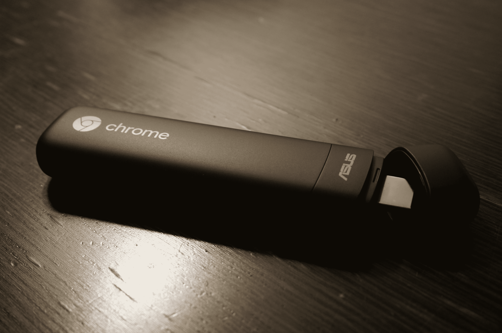

# 谷歌和华硕推出售价 85 美元的 Chromebit，这是一款安装在 HDMI 棒上的 Chrome OS 桌面

> 原文：<https://web.archive.org/web/http://techcrunch.com/2015/11/17/google-and-asus-launch-the-85-chromebit-a-chrome-os-desktop-on-an-hdmi-stick/?utm_content=bufferb26e5&utm_medium=social&utm_source=plus.google.com&utm_campaign=buffer>

今年早些时候，谷歌和华硕发布了 Chrome bit——一款基于全 Chrome 操作系统的 HDMI 棒电脑。今天，这两家公司正式推出了这种在任何带有 HDMI 端口的屏幕上使用 Chrome OS 的新方式。

85 美元的 Chromebit 是一个 75 克(或 2.6 盎司)的棒，可以插入任何 HDMI 端口——无论是普通的电脑屏幕还是客厅里的大电视。它配备了 16GB 的板载存储(相对便宜和缓慢的 eMMC 存储)和 2GB 的内存。

在许多方面，它是旧 Chromecast stick 的更大、更笨重的版本。就像那台设备一样，它配有专用充电器，但与 Chromecast 不同的是，它还配有 USB 端口。基于 Rockchip 的 Chromebit 有“可可黑”和“橘橙”两种颜色，但总的来说，它是一款非常不起眼的设备，无论如何都应该消失在你的屏幕后面(因此我不确定为什么会有橙色版本)。

虽然大多数人可能希望使用蓝牙鼠标和键盘来连接 Chromebit，但 USB 端口也允许你插入有线外设(通过 USB 集线器，你甚至可以插入多个设备)。

 因为这是一台全 Chrome 操作系统的机器，你几乎可以在上面运行任何网络应用。举例来说，它可以让你播放来自 Google Play、网飞或 Hulu 的电影和电视节目，就像任何其他 Chrome OS 设备一样。

如果你想的话，你可能会把 Chromebit 作为一个有点笨重的媒体中心放在你的客厅里，但它真的是在学校、企业或者呼叫中心的家里。只要工作只涉及网络应用程序(或者可能是一台功能更全的机器的远程连接)，Chromebit 就能胜任这项工作，可以将任何屏幕变成可用的桌面。例如，如果你想把任何现代屏幕变成酒店或商店里的[单应用信息亭](https://web.archive.org/web/20230130235752/https://www.google.com/work/chrome/devices/for-kiosks/)，这也是一个选择。

谷歌为我提供了一个评测单元，在我不得不测试该设备的短暂时间内，它的表现相当不错。不要指望为设备提供动力的四核 Rockchip SoC 会有惊人的性能，但它完全可用。

在美国，Chromebit 将在亚马逊、Fry's 和新蛋上市(有趣的是，谷歌通常的 Chrome OS 合作伙伴百思买不在最初的供应商名单中)。它也将在澳大利亚、加拿大、丹麦、芬兰、日本、新西兰、挪威、西班牙、瑞典、台湾和英国推出。

谷歌的工作和教育客户也可以选择添加新的[单应用信息亭模式](https://web.archive.org/web/20230130235752/http://googleforwork.blogspot.com.es/2015/11/reaching-customers-with-kiosks-and-digital-signage-just-got-simpler.html)选项，每用户每年 24 美元，在美国和加拿大通过 CDW 提供。

