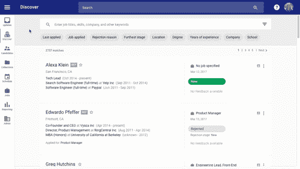
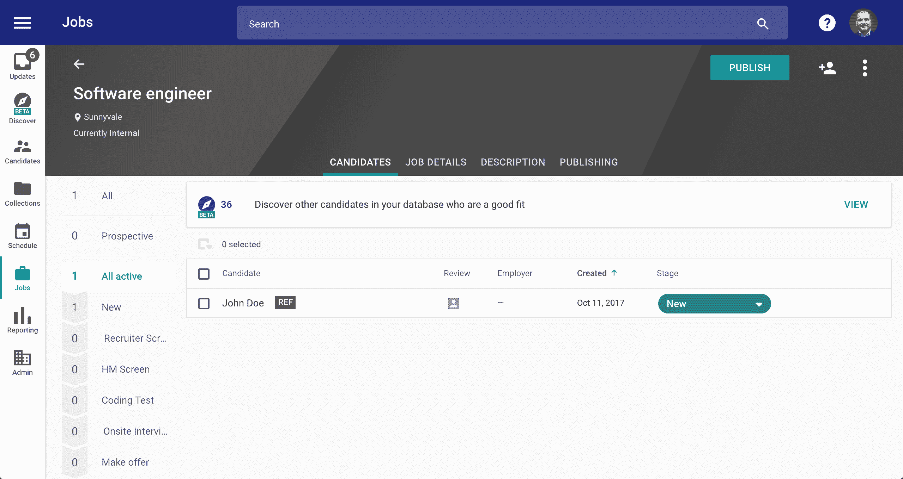
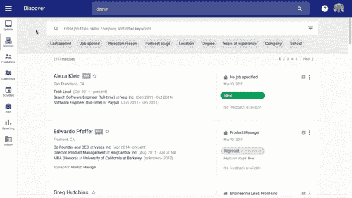

# 谷歌招聘让你更容易找到合适的求职者

> 原文：<https://web.archive.org/web/https://techcrunch.com/2018/03/28/hire-by-google-makes-it-easier-to-find-the-right-job-candidates/?utm_content=social-2yxoh&utm_medium=social&utm_source=SocialMedia&utm_campaign=SocialPilot>

# 谷歌招聘让你更容易找到合适的求职者

谷歌为招聘人员和招聘经理提供的服务今天在[推出了几个新功能](https://web.archive.org/web/20230327070815/https://www.blog.google/products/hire/recruiting-gets-easier-candidate-discovery-hire-google/)，这将使在之前申请公司职位的潜在员工中找到合适的候选人变得更加容易。

这里的想法是更好地利用公司现有的候选人数据库，因为其中的候选人显然对为公司工作感兴趣，即使他们不一定非常适合以前的空缺职位。

招聘团队的产品经理奥马尔·爱德华多·费尔南德斯(Omar Eduardo Fernández)在今天的公告中写道:“每聘用一个人，一家公司通常会聘用 250 名候选人。”。“通常情况下，249 名未被录用者中有许多非常适合未来的空缺职位——但公司并不总是有一个简单的方法来识别可能与新工作很匹配的过去的候选人。”

为了更好地挖掘过去的求职者，新的所谓“候选人发现”会查看招聘广告的职位描述、头衔和位置，并将其与过去的候选人列表进行匹配。正如谷歌指出的，Hire 利用公司的搜索智能来更好地理解招聘者的意图。这意味着该服务可以很容易地解析作业的位置，例如，即使它没有在“位置”字段中明确指定，而只是部分文本。

虽然我们已经看到了相当多的 [公告](https://web.archive.org/web/20230327070815/https://techcrunch.com/2017/06/20/google-launches-its-ai-powered-jobs-search-engine/)围绕谷歌最近几个月的整体求职努力，但其中大多数都专注于帮助求职者找到潜在的职位。现在，看起来谷歌已经准备好把重点放回谷歌招聘上了(又名*谷歌招聘*，取决于你问谁)，所以我希望在不久的将来我们会听到更多关于这项服务的消息。