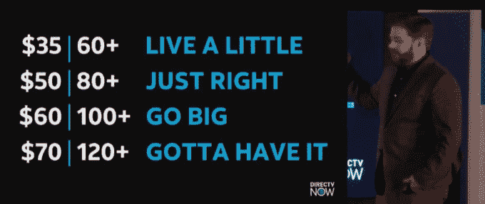
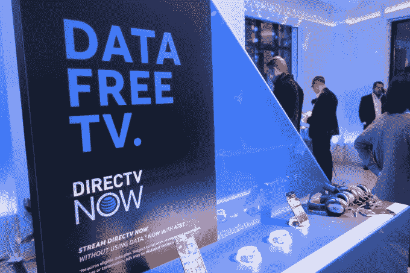

# 美国电话电报公司推出电视流媒体服务 DirecTV Now，将于 11 月 30 日发布 

> 原文：<https://web.archive.org/web/https://techcrunch.com/2016/11/28/att-unveils-its-tv-streaming-service-directv-now-which-will-launch-on-nov-30/?utm_medium=email&utm_campaign=CP-11-28-16>

美国电话电报公司今天在纽约市举行的一次活动上正式推出了 DirecTV Now 直播电视流媒体服务。这项服务将于 11 月 30 日推出，于今年早些时候首次宣布。

关于这项新服务的许多细节已经报道过了，包括每月 35 美元的起价，以及 100 多个频道，可以选择添加 HBO 和 Cinemax 等付费网络。

“理解这一点真的很重要，这是我们未来做事方式的基础，”美国电话电报公司娱乐首席执行官约翰·斯坦基说。“在我们的历史上，我们第一次控制了整个堆栈。”

DirecTV 现在正在进入一个日益拥挤的流媒体服务市场，将与 Dish 的 Sling TV、索尼的 PlayStation Vue 和 Hulu 即将推出的直播电视服务等竞争对手直接竞争。(我们应该注意，美国电话电报公司的竞争对手威瑞森拥有 TechCrunch。)

为了吸引客户，这些竞争对手正在专注于各种卖点，如分层定价、同步流媒体、用户体验、跨平台支持、频道阵容和其他消费者友好的功能，如用于录制流媒体电视节目和电影的云 DVR。事实上，Sling TV 今天早上刚刚[宣布](https://web.archive.org/web/20221005200113/https://beta.techcrunch.com/2016/11/28/sling-tv-takes-on-rivals-with-launch-of-a-cloud-dvr/)它自己的云 DVR。

该公司宣布，DirecTV Now 也将从明年开始提供云 DVR。然而，它目前仅限于 2 个并发流，这使它处于劣势。

美国电话电报公司最初的目标是通过向付费用户提供免费流媒体播放器来吸引新用户。签约三个月的用户将免费获得一台 Apple TV，付费一个月的用户将免费获得一个亚马逊 Fire 电视棒。

与其竞争对手一样，DirecTV 现在也在价格上展开竞争，60 多个频道的价格低于有线电视和卫星电视提供商的传统付费电视服务，每月 35 美元，120 多个频道的价格计划将上涨至每月 70 美元。用户可以每月额外支付 5 美元来增加 HBO 和 Cinemax。

在你付费之前，将会有 7 天的免费试用期，现在有限的 DirecTV 将通过免费观看模式提供。

它还提供促销价格，将提供每月 35 美元的 100 多个频道的“Go Big”($ 60/月)套餐。那些以这种速度注册的人，只要他们使用这项服务，就不会受到影响。

有趣的是，美国电话电报公司服务不仅在内容和推荐方面对用户个性化，它还会使用个性化广告。

美国电话电报公司娱乐公司的执行副总裁兼首席技术官 Enrique Rodriguez 将其描述为“美国电话电报公司的一种全新的成本结构”，这在一定程度上意味着通过有针对性的广告来降低成本。

当被问及如何实现这一点的更多细节时，罗德里格斯说，在遵守现有的数据隐私规则的同时，这项服务将“理解你作为消费者正在享受的东西，并提供可能与你相关的内容以及对你有更大影响的广告。”

他补充说，有了 DirecTV Now，“我们个性化和针对每台设备(而不仅仅是每名消费者)投放广告的能力比过去显著提高了。”

除了哥伦比亚广播公司和受欢迎的有线电视网，DirecTV 现在将为大多数主要的广播网络带来超越顶部的接入，减去 Showtime。由于与 21 世纪福克斯公司签订了福克斯有线电视网的协议，其频道阵容将包括顶级电视网；华特·迪士尼；[新收购的](https://web.archive.org/web/20221005200113/https://beta.techcrunch.com/2016/10/22/confirmed-att-is-buying-time-warner-for-85-4b-in-cash-and-shares/?ncid=rss)时代华纳等。

通过与时代华纳的合并，[在& T 获得了](https://web.archive.org/web/20221005200113/https://beta.techcrunch.com/2016/10/23/atts-new-streaming-service-directv-now-just-got-a-lot-more-interesting/)HBO，CNN，TBS，TNT，卡通网络，以及华纳兄弟电影工作室，哈利波特和 DC 漫画系列的所在地。通过特纳，它拥有 NBA，疯狂三月和 MLB 的权利。还将有视频点播选项——15，000 个标题开始。

DirecTV 现在将有一些独家节目，它希望这将有助于吸引新的订户。这将包括它自己的原创节目，如泰勒·斯威夫特的 13 集系列《泰勒·斯威夫特现在》，将在几周内上映。此外，来自瑞茜·威瑟斯彭的新制作公司的内容将于明年到达。她在活动中说:“你好，阳光”专注于由女性创作的女性内容。

然而，DirecTV Now 最大的卖点——也是最具争议的卖点之一——是美国电话电报公司用户可以从这项服务下载到他们的智能手机和平板电脑，而无需接入他们的无线数据计划。联邦通信委员会已经介入此事，[在& T 发出一封信，质疑其所谓的“零评级](https://web.archive.org/web/20221005200113/http://fortune.com/2016/11/11/fcc-zero-rating-att-time-warner/)”的使用。

目前还不清楚这最终会如何发展——例如，美国电话电报公司可能会被要求向竞争对手提供同样的零费率无线流媒体服务。或者它可能会失去对自己的内容进行零评级的选择。

美国电话电报公司的高管们也快速参观了该产品。与 Sling TV 或 Vue 等流媒体电视竞争对手相比，用户体验感觉更像网飞。DirecTV Now 的主页展示的不是线性指南，而是直播节目以及你之前观看的节目，还有你定制的观看列表。此外，用户可以设置自己的收藏夹，以便于访问。

它还会提供一些推荐，如一系列新节目、按流派组织的节目(如“孩子”)、美国电话电报公司原创、美国电话电报公司合作伙伴全屏内容等等。

在发布时，DirecTV Now 将通过亚马逊 Fire TV/Fire TV Stick、Android、iOS、Chromecast、Apple TV、LeEco ecotvs 和 VIZIO SmartCast 显示器以及网络提供。明年将支持更多设备，包括 Roku 流媒体播放器和 Roku 电视型号，亚马逊 Fire 平板电脑，以及三星和其他品牌的智能电视。