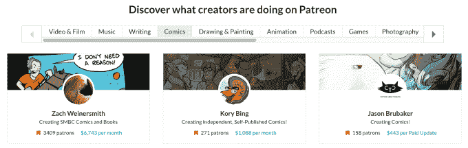
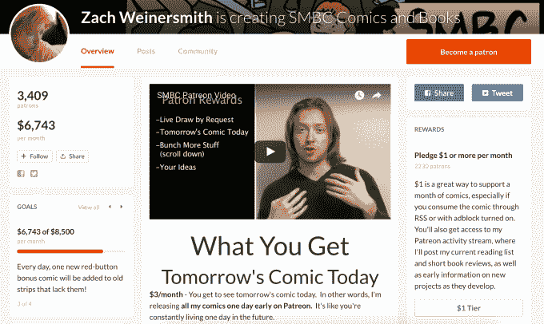
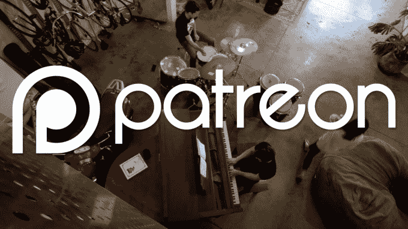

# Patreon 在一年内翻了一番，拥有 100 万付费用户和 5 万名创作者 

> 原文：<https://web.archive.org/web/https://techcrunch.com/2017/05/18/patreon-pushes-as-youtube-stutters/?utm_medium=email&utm_source=patreonblog&utm_campaign=051817A>

帕特里翁关于粉丝直接付钱给他们喜欢的艺术家的新颖想法正在发挥其曲棍球棒的作用。Patreon 告诉 TechCrunch，在一年内，每月活跃付费用户的数量翻了一番，达到 100 万，活跃创作者的数量达到 5 万。它现在有望在 2017 年向创作者支付 1.5 亿美元，这将使其 5%的削减相当于 750 万美元的收入。这是在自 2014 年以来支付了总计 1 亿美元之后。

摄像师、音乐家、作家、插画师、动画师、播客、游戏开发者和更多艺术家正在通过 Patreon 找到稳定的收入，而其他平台对创作者来说似乎不稳定。

在 PewDiePie 丑闻警告广告商他们与令人反感的内容一起出现后，YouTube 开始让他们过滤掉某些频道。结果是 YouTube 明星的收入减少了。[藤死了](https://web.archive.org/web/20221007134805/https://beta.techcrunch.com/2017/01/17/download-vine-camera/)。Snapchat 忽视了创作者，拒绝向他们提供直接的货币化选择，现在由于放弃自动推进和来自 Instagram 的竞争，T4 的浏览量下降了。

与此同时，Instagram 不与创作者分享广告收入。脸书已经开始给一些视频制作者 55%的收入，这些收入来自他们在视频片段中插入的广告插播，但是这个项目还没有扩大规模。广告支持的平台通常每次观看仅支付 0.10 至 0.0005 美元，因此创作者必须广受欢迎才能谋生。

然而，在 Patreon 上，贡献者经常每月向他们最喜欢的创作者支付 5 美元，这些创作者从每个粉丝身上获得的收入是广告收入的 50 到 10，000 倍。作为交换，创作者提供他们当月创作的作品，并保留额外的使用权和奖励给那些支付更多的人。35 名创作者在 2016 年的收入超过 15 万美元，数千人的年收入超过 2.5 万美元。

“通过与粉丝直接联系，Patreon 上的创作者正在建立一个稳定、持续的收入来源，并获得内心的平静和创作自由，以建立他们作为创作者的职业生涯，”Patreon 的 Maura Church 写道。

Patreon 本身已经从投资者那里筹集了 4700 万美元，包括 2016 年 1 月由 Thrive Capital 牵头的[3000 万美元 B 轮](https://web.archive.org/web/20221007134805/https://beta.techcrunch.com/2016/01/19/patreon-gains-30-million-series-b-funding-experiencing-major-growth/)。到这个时候，它很可能准备再筹集一些资金，这就解释了它为什么向媒体大肆宣传这些势头数据。Patreon 稳定的经常性收入模式可以吸引现金来扩大对创作者的影响，并为他们建立更多的增长、分析和货币化工具。

幸运的是，因为它不需要托管广告，Patreon 可以对它支持的创作者类型更随意一些。它允许色情绘画等不安全的工作内容，但也因其言论自由的观点而受到批评，这种观点允许公然冒犯的内容制作者利用该网站。Patreon 还必须抵御 Steady 等竞争对手，并智胜 Kickstarter 和 Indiegogo 等更大的一次性项目众筹平台。

然而，互联网内容创作的宏观转变对帕特里翁有利。

通过网络免费分发使艺术家和粉丝脱离中介，为利基、两极分化的创作者打开了大门，这些创作者永远无法通过主流大众媒体渠道如好莱坞电影、电视、广播或报纸进行分发。支付和商业软件让创作者独立运作，不需要一个总的制作工作室、唱片公司或出版商。随着实体媒体的消退和数字媒体变得越来越自由，热情的粉丝们正在寻求各种方式来证明他们对艺术家的热爱，并支持他们的工作。

随着每一个顾客和每一个创造者的加入，Patreon 的网络效应也在增长。平台上有更多的贡献者可以呼吁，也有更多的创客可以即时发现和捐赠。这给 Patreon 带来了更多的管理权力，当顶级创作者加入时，他们可以将注意力转移到他们身上。在大范围内，当其他人抛弃观众和艺术家时，即使只拿 5%的提成也能在他们之间架起一座利润丰厚的桥梁。

*【图片来源:[本·亚当斯](https://web.archive.org/web/20221007134805/https://www.patreon.com/benjadams) via Patreon 主页】*