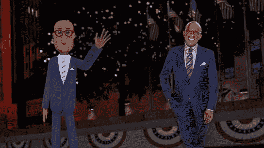
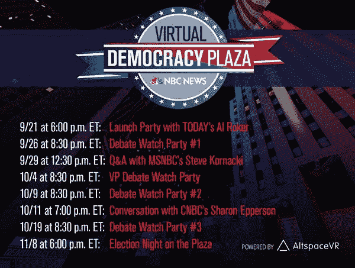

# NBC 将从今晚开始在虚拟现实中直播辩论和其他选举报道 

> 原文：<https://web.archive.org/web/https://techcrunch.com/2016/09/21/nbc-will-stream-the-debates-and-other-election-coverage-in-vr-starting-tonight/?utm_source=Daily+Email&utm_medium=email&utm_campaign=160921>

在 ABC 新闻的帮助下，脸书正在直播总统辩论[，而](https://web.archive.org/web/20230129090302/https://techcrunch.com/2016/09/20/abc-news-teams-up-with-facebook-to-live-stream-the-2016-general-election-debates/)[推特今天早上宣布，由于彭博的合作，它将主持自己的直播](https://web.archive.org/web/20230129090302/https://techcrunch.com/2016/09/21/twitter-to-live-stream-u-s-presidential-debates-via-bloomberg-partnership/)。然而，为了在技术上超越他们，NBC 将在虚拟现实中直播辩论。

欢迎来到未来，在这里看电视是只有奶奶还在做的奇怪的事情。

NBC 表示，它正与 [AltspaceVR](https://web.archive.org/web/20230129090302/http://altvr.com/) 合作，从 9 月 21 日晚上开始，推出一系列以选举为主题的虚拟现实活动。

在美国东部时间下午 6 点，你将能够“收听”(我们还能这样称呼它吗？)去见 NBC 的阿尔·罗克——嗯，他的虚拟现实化身——在那里他将首次亮相 NBC 的“虚拟民主广场”

这是 NBC 新闻在总统选举季运行的洛克菲勒中心真实“民主广场”的 VR 版本，其中包括投影在溜冰场上的全国地图。该网络称，Roker 将在那里谈论他在广场上最喜欢的时刻，并回答观众的问题。

临近选举之夜，NBC 将举办各种不同的虚拟现实活动，包括辩论观看派对、政治专家问答、政治喜剧节目等。

目前的阵容还包括 MSNBC 的史蒂夫·科尔纳奇(Steve Kornacki)，他将于美国东部时间 9 月 29 日中午 12:30 加入，分析选举的状况，以及美国消费者新闻与商业频道的莎伦·埃珀森(Sharon Epperson)，他是[《你的钱，你的未来》](https://web.archive.org/web/20230129090302/http://www.cnbc.com/your-money-your-future/%20)和数字视频系列[《好好退休吧](https://web.archive.org/web/20230129090302/http://www.cnbc.com/retirewell/)的主持人她将于 10 月 11 日抵达，回答游客关于选举的个人财务问题。

观众可以使用 Oculus Rift、HTC Vive 或三星 Gear VR 上的 AltspaceVR 应用程序参加。然而，对于那些好奇但缺乏设备的人来说，这些活动的 2D 版本将在 altvr.com/nbcnews.通过 Mac 和 PC 提供

[AltspaceVR 成立于 2013 年，由超过 1500 万美元的](https://web.archive.org/web/20230129090302/https://techcrunch.com/2015/06/12/vr-chat/)[资金](https://web.archive.org/web/20230129090302/https://techcrunch.com/2015/07/29/pay-per-virtual-reality/)支持，于 2015 年 6 月正式推出其 VR 聊天室平台。此后，它举办了许多虚拟现实活动，包括电影放映、电子竞技活动、游戏玩家聚会、聚会、现场音乐会、喜剧专场等。

雷吉·沃茨(Reggie Watts)在虚拟现实中的一次活动可能有助于这家初创公司为即将到来的选举报道做准备，因为它吸引了有史以来最大的人群，并看到了超过 1200 名同时观看者的峰值使用。该公司[承认](https://web.archive.org/web/20230129090302/http://altvr.com/reggie-watts-performs-to-the-largest-crowd-in-vr-ever/)技术上的困难阻止了一些用户进入，该活动也帮助它发现了它仍然需要解决的扩展问题。

希望这些问题能在 NBC 的选举报道中及时解决。但是今晚我们就能知道了。