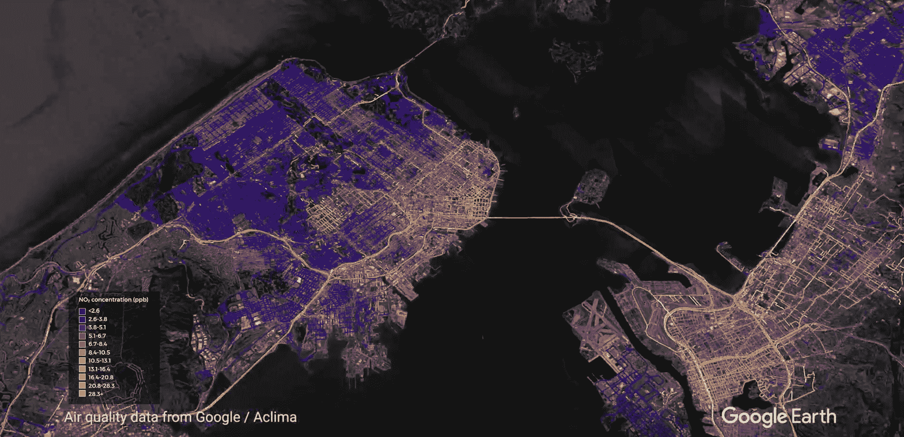

# 谷歌街景汽车将在地球上漫游，通过这些传感器检查我们的空气质量 

> 原文：<https://web.archive.org/web/https://techcrunch.com/2018/09/12/google-street-view-cars-are-now-roaming-around-the-planet-checking-our-atmosphere-with-these-sensors/?utm_source=dlvr.it&utm_medium=gplus>

# 谷歌街景车将在地球上漫游，用这些传感器检查我们的空气质量

总部位于旧金山、制造联网空气质量传感器的初创公司 Aclima 宣布，计划将其移动传感平台整合到谷歌的全球街景车队中。

谷歌使用街景车为谷歌地图绘制地图。从休斯顿、墨西哥城和悉尼的 50 辆汽车开始，Aclima 将在谷歌汽车漫游街道时，通过生成二氧化碳(co2)、一氧化碳(CO)、一氧化氮(NO)、二氧化氮(NO2)、臭氧(O3)和颗粒物(PM2.5)的快照来捕捉空气质量数据。这个想法是为了确定在每个大都市地区的超局部水平上哪里可能有太多的污染和其他呼吸问题。这些数据将作为公共数据集在 Google BigQuery 上公开。

Aclima 在过去几年中与谷歌有着密切的关系，这并不是它第一次乘坐街景车。这家初创公司今年早些时候使用谷歌的车辆在伦敦部署了传感器，并在三年前开始与这家科技巨头合作，以确定谷歌在 T2 的园区以及湾区周围的空气健康状况。

“所有这些工作最终导致了一项[重大科学研究](https://web.archive.org/web/20230209130912/https://pubs.acs.org/doi/10.1021/acs.est.7b00891)，”Aclima 创始人 Davida Herzl 告诉 TechCrunch，他指的是发表在《环境科学与技术》上的一项研究，该研究揭示了城市街道沿线的空气污染水平相差五到八倍。“我们发现，同一条街上可能有空气质量最好的和最差的……了解这一点有助于从城市规划到了解你的个人暴露程度

这项初步研究现在使 Aclima 能够与谷歌的街景汽车一起扩大规模，希望在全球范围内收集更多数据。谷歌街景汽车覆盖了所有七大洲的道路，自 2015 年与 Aclima 的初始项目开始以来，仅在加利福尼亚州就已经行驶了超过 10 万英里，收集了超过 10 亿个数据点。

据该公司称，第一辆装有最新 Aclima 传感器的街景汽车将于今年秋天在美国西部和欧洲上路。

“这些测量可以为城市提供新的邻里级见解，帮助城市加快向更智能、更健康的城市过渡的努力，” 谷歌地球拓展项目经理卡琳·图克森-贝特曼在一份声明中说。