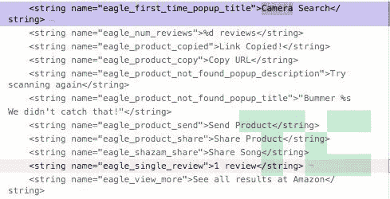

# Snapchat 代码揭示了与亚马逊在“相机搜索”方面的合作

> 原文：<https://web.archive.org/web/https://techcrunch.com/2018/07/09/snapchat-camera-search/?utm_source=feedburner&utm_medium=feed&utm_campaign=Feed%3A+Techcrunch+%28TechCrunch%29>

Snapchat 正在建立一个可视化的产品搜索功能，代号为“Eagle”，将用户带到亚马逊的列表中。Snapchat 的 Android 应用程序代码中隐藏着一个尚未发布的“视觉搜索”功能，在这个功能中，你可以“按住来识别一个对象、歌曲、条形码等等！这是通过向亚马逊、Shazam 和其他合作伙伴发送数据来实现的。”一旦一个物品或条形码被扫描，你就可以“在亚马逊上看到所有结果”

【更新:Snap 通过宣布在 9 月 24 日推出 [Snapchat 的亚马逊视觉搜索工具](https://web.archive.org/web/20221208052314/https://techcrunch.com/2018/09/24/snapchat-amazon-visual-search/)来确认我们的独家新闻。]

视觉产品搜索可能会使 Snapchat 的相机成为一个更通用的工具，用于查看和导航世界，而不仅仅是一个社交媒体制造商。这可能会将 Snapchat 与 Instagram 区分开来，insta gram 的 Snapchat Stories 克隆版现在拥有两倍多的用户，增长速度是 insta gram 的六倍

增长速度比原来快。如果 Snapchat 与亚马逊达成了会员推荐协议，它可能会开辟新的收入来源。Snap Inc .上个季度亏损 3.85 亿美元，收入低于预期 1400 万美元，这正是 Snap Inc .迫切需要的。

应用研究员[伊山·阿加瓦尔](https://web.archive.org/web/20221208052314/https://twitter.com/IshanAgarwal24)向 TechCrunch 透露了隐藏的 Snapchat 代码。他的建议之前曾导致 TechCrunch 独家报道 Instagram 的视频通话、音轨、焦点人像模式和 QR 姓名标签功能，这些功能后来都正式推出。在发稿前，亚马逊没有回应记者的询问，也不清楚它是否积极参与了 Snapchat 视觉搜索的开发，或者只是其结果的目的地。Snap 已经在亚马逊上销售其 [Spetacles v2 相机眼镜](https://web.archive.org/web/20221208052314/https://techcrunch.com/2018/04/26/snapchat-spectacles-2/)，这是其网站之外唯一的地方。Snap Inc .对 TechCrunch 的视觉搜索“不予置评”，但该公司的代码讲述了这个故事。

早在 2016 年，Snapchat 就通过其 [Shazam 集成](https://web.archive.org/web/20221208052314/https://support.snapchat.com/en-US/a/shazam-song)首次尝试了解你周围的世界，让你点击并按住以识别附近播放的歌曲，在 Shazam 上查看它，将其发送给朋友或在 Snapchat 上关注艺术家。Project Eagle 基于这一音频搜索功能，通过类似的界面和一组合作伙伴关系提供视觉搜索。识别可购买物品或扫描条形码的能力可能会让 Snapchat(一些人将其视为青少年玩具)变得更加实用。

## Snapchat 的鹰眼里面有什么

Snapchat 的代码没有确切解释 Project Eagle 功能将如何工作，但在 Snapchat 的最新版本中，它被重命名为“相机搜索”。如果你还记得的话，Snap 使用了另一个动物名称“猎豹”，作为其大规模重新设计的秘密词汇。该应用程序的代码列出了显示“卖家”和“评论”、“复制产品的 URL”以及向朋友“分享”或“发送产品”的能力——可能通过 Snap messages 或 Snapchat Stories。在典型的酷孩子青少年用语中，“产品未找到”的错误信息是“糟糕，我们没有发现！”

Eagle 的视觉搜索可能会连接到 [Snapchat 的“上下文卡”](https://web.archive.org/web/20221208052314/https://techcrunch.com/2017/10/10/snapchats-new-context-cards-use-snaps-for-spontaneous-discovery/)，它于去年年底首次亮相，可以调出商务联系信息、餐厅预订、电影票、Ubers 或 Lyfts 等信息。在 Snapchat 中出现一张关于可拥有物品的详细信息的背景卡片，可能是让用户购买它们的第一步……也是让广告商向 Snap 付费来推广它们的第一步。很容易想象，在 Snap 广告中标记的产品以及通过视觉搜索扫描的产品都可以访问上下文卡。而且 [Snap 已经有了应用内购物](https://web.archive.org/web/20221208052314/https://techcrunch.com/2018/02/01/snapchat-snap-store/)。

Snapchat 的相机搜索可能会成为 Pinterest 的镜头的直接竞争对手，后者可以识别物体并显示相关内容。Pinterest 对该产品进行了改进，将其嵌入 Target 等零售商的应用程序中。除了购物，相机搜索还可以让 Snapchat 用户找到包含他们正在拍摄的相同对象的故事。

能够识别你看到的东西让 Snapchat 变得更有趣，但这也是一种导航现实的新方式。2017 年年中 [Snapchat 推出了世界镜头](https://web.archive.org/web/20221208052314/https://techcrunch.com/2017/04/18/snapchat-introduces-world-lenses-live-filters-for-just-about-anything/)，它可以绘制你周围的表面，这样你就可以在真实的地方将 3D 动画物体(如跳舞的热狗吉祥物)与真实的人放在一起。Snapchat 去年还发布了一个由机器视觉驱动的搜索功能，它可以编辑用户提交的以你选择的关键词为特色的照片，比如带有“小狗”或“烟花”的视频，即使字幕没有提到它们。

Pinterest 的镜头视觉搜索功能

Snapchat 对视觉搜索非常感兴趣，据报道，今年它与机器视觉初创公司 Blippar 进行了早期收购谈判。与英国增强现实公司的谈判失败了，该公司已经为自己的视觉搜索功能筹集了至少 9900 万美元，但由于使用率低和融资困难，最近开始内爆。Snap Inc .可能一直希望启动其相机搜索业务。

毕竟，Snap 自称是一家相机公司。但是，由于其平庸的 v1 眼镜销售疲软，广受好评的 v2 未能融入文化时代精神，并且市场上没有其他硬件产品，Snap 可能需要重新定义这句口号的确切含义。视觉搜索可以让 Snapchat 更像一个传感器，而不仅仅是一个摄像头。随着它在快速自拍信息中的广泛使用，它已经成为一些青少年看世界的镜头。很快，Snap 就可以训练自己在购买方面的鹰眼，而不仅仅是人脸。

*相关 Snapchat 新闻:*