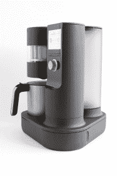
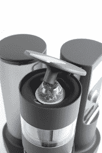

# 山茶花实验室首次推出单杯 chai brewer，Chime 

> 原文：<https://web.archive.org/web/https://techcrunch.com/2016/05/21/camellia-labs-debuts-single-cup-chai-brewer-chime/?utm_source=inshorts&utm_medium=inshorts_full_article&utm_campaign=inshorts_full_article>

在厨房电器的世界里，似乎每个人都想成为下一个 Keurig。

首先，有单杯咖啡制造商紧随其后，声称比 Keurig 更好，从 Nespresso，咖啡先生和 Lavazza 等。

后来出现了冷饮机，如鸡尾酒的 Bartesian 或精酿啤酒的 PicoBrew。最近，Juicero 冷榨果汁机承诺为我们省去切和清理有机水果的痛苦。

现在，柴(音译)正在利用山茶花实验室研发的一款名为[钟声](https://web.archive.org/web/20221007140326/http://www.brewchime.com/)的新设备迎来自己的硬件时刻。

[Camellia Labs](https://web.archive.org/web/20221007140326/http://www.camellialabs.com/) 由首席执行官 Guarav Chawla 和 Samip Bhavsar 于 2014 年创立，他们认识到咖啡并不是世界之王。乔拉解释说，在印度，对大多数家庭来说，柴是每天甚至每天五次的仪式。

Camellia Labs 正在开发 Chime 单杯 chai 啤酒酿造器。

但是用标准的方法做茶需要等很长时间，让牛奶沸腾，但不要煮过头，还要等从各种香料和红茶中提取出合适的味道。它也给酿酒商留下了一个装满用过的树叶的水槽。

Camellia Labs 为 chai 设计了一款单杯啤酒，并在北美的南亚移民群体中看到了巨大的潜在市场。最终，这家初创公司希望让所有人都迷上柴。

联合创始人说，真正的 chai 与包括星巴克在内的大多数美国咖啡馆里的 chai 或 chai latte 的水状仿制品和甜味盒装或粉状混合物完全不同。

这个可爱的名字叫 Chime，大约 14 英寸高，包括一个用于该公司可回收茶胶囊的位置，以及一个单独的茶壶和牛奶瓶。它承诺在 3 分钟内冲泡一杯正宗的柴。

这种钟声也是“智能的”，允许用户通过蓝牙连接的智能手机和应用程序调整茶与牛奶的比例、杯子大小、冲泡浓度和温度。用户可以将他们的偏好保留为预设。

尽管 Camellia Labs 仍在为制造原型做准备，但它也在与印度的茶叶和香料供应商一起开发茶胶囊。这种胶囊含有豆蔻、生姜、玫瑰和马萨拉等传统柴配料，零售价为 1 美元一粒，这是该公司除硬件销售之外的经常性收入来源。

作为 [YouWeb 9Plus 孵化器](https://web.archive.org/web/20221007140326/http://www.youwebinc.com/)的一部分，Camellia Labs 本周在 BrewChime.com 提供了可预购的钟声，并承诺在 2017 年初发货给客户。

早期购买者将支付 249 美元购买一台机器，包括运费和 60 个茶叶和香料的“编钟帽”。

联合创始人说，该公司打算最终以 400 美元左右的零售价出售这款钟。

当被问及是否担心将茶变成一种需要一次性胶囊而不仅仅是散叶香料和茶叶的习惯会增加垃圾填埋场溢出的废物时，该公司的首席执行官 Chawla 说，环境可持续性仍然是一个长期关注的问题。

他说，Camellia Labs 一直在评估可以在他们的机器中使用的新的可回收或可堆肥材料。