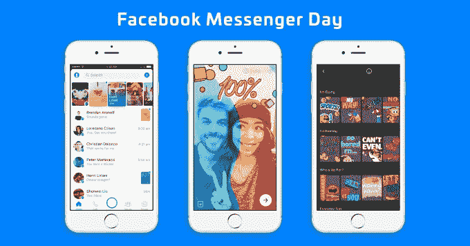

# 那次脸书走得太远了 

> 原文：<https://web.archive.org/web/https://techcrunch.com/2017/03/10/that-time-facebook-went-too-far/?utm_source=mandiner&utm_medium=link&utm_campaign=mandiner_202208>

脸书试图克隆 Snapchat 的尝试没有止境。

这家社交网络巨头处于令人羡慕的地位，拥有许多世界上最常用的互联网服务和应用程序。脸书社交网络接近 20 亿注册用户——这是历史上前所未有的全球覆盖水平——而其 Messenger 应用程序拥有 10 亿活跃用户。

该公司进行了明智的投资，它的两项收购同样受欢迎，也同样国际化。WhatsApp 在全球拥有超过 10 亿活跃用户，主要集中在新兴市场，而 Instagram 在去年夏天达到了 5 亿用户，并且在除中国以外的世界几乎每个地方都继续快速增长。

脸书是一代人中独一无二的巨兽，因为它的规模是其他公司所没有的，至少在这一代人中是不可能达到的。

通过成长，它为其他社交网络和服务制定了严格的标准。举例来说，与脸书的比较已经让 Twitter 及其增长的失败受到了打击，它也让新上市公司 Snap 的投资者感到不安。

## 所有聊天记录中的所有快照

然而，尽管取得了这些成就，马克·扎克伯格和他的团队似乎决心要胜过 snap，他曾试图以 30 亿美元收购该公司，方法是将其应用程序的核心——消失的照片功能克隆到脸书拥有的每一块数字房地产中。

这种专注似乎正在为 Instagram 工作——我们报道过[正在从用户和影响者两方面挖掘 Snap 的业务](https://web.archive.org/web/20221005221057/https://beta.techcrunch.com/2017/01/30/attack-of-the-clone/)——但脸书对所有可能的克隆机会的不懈追求现在正式走得太远了。本周[推出了 Facebook Messenger](https://web.archive.org/web/20221005221057/https://beta.techcrunch.com/2017/01/09/wechat-mini-programs/) 的 Messenger Day，上个月[为 WhatsApp 增加了一个类似的功能](https://web.archive.org/web/20221005221057/https://beta.techcrunch.com/2017/02/20/whatsapp-status/)。

Messenger 和 WhatsApp，可以说是当今以移动通讯为中心的世界中的两颗珍贵的宝石，已经被克隆了——结果似乎远没有令人印象深刻。

作为一个生活在脸书首次测试 Messenger Day(其高管拒绝承认 Snapchat 克隆版抄袭 Snapchat)的市场的人，我可以说新功能只会让我对 Messenger 的使用变得不愉快。

尽管它位于应用程序顶部，没有隐藏或删除的选项，但我从未见过来自亚洲、欧洲和美国的 600 多名脸书朋友中有超过三人在一天内使用它。我交谈过的其他人也看到了类似的用法(缺乏)。

更糟糕的是，脸书无意中让人们在不知情的情况下进入了这个照片分享的新世界。

当您在 Messenger 聊天窗口中共享图像时，不断弹出的提示导致了令人尴尬的意外帖子。一个朋友在“信使日”张贴了银行转账的确认，通过信使发送给接收者作为确认因为不清楚如何移除图像，他整天畏缩不前，因为它坐在那里让所有人看了 24 小时，最后才消失。

这项功能刚刚在美国推出，但迹象似乎并不太令人鼓舞。

https://twitter.com/stevekovach/status/840043912072900608

除了推特用户，年轻人——被认为是脸书克隆尝试的主要目标之一——似乎并不太重视新的信使日功能。

“我的学校朋友认为脸书日很荒谬，我也是如此，”20 岁的学生蒂芙尼·钟告诉 TechCrunch，她曾在风险投资公司二元资本公司工作。

“不幸的是，围绕脸书日的情绪显然都是负面的。但对脸书在复制 Snapchat 上的无情和无耻大喊大叫！”她补充道。

钟说，她在新服务上贴了一张照片，标题是“这是什么废话”，她惊讶地发现，她从朋友那里得到的所有回复都是负面的。

“为什么现在一切都是关于创造故事。我讨厌它，lmao，”一个人告诉她。

这可不是脸书总部希望得到的回应。

## SnapsApp

不仅仅是 Messenger，WhatsApp 的体验也同样令人失望。

我在 WhatsApp 上认识的人中，很少有人使用过新的 Snapchat 状态功能，其中很多人都在印度或其他国家，WhatsApp 是印度的主要通讯应用。

从交谈中，大多数人不清楚为什么他们首先要发布自毁照片，而其他更懂技术的朋友，也许是受西方互联网文化的影响，宁愿发布到一个家人和朋友不会收到他们照片的地方。总的来说，后一部分的答案是 Snapchat，而不是 WhatsApp 或 Messenger。

除了努力吸引据报道放弃其服务前往父母不在的地方的年轻人之外，脸书关于 Messenger 和 WhatsApp 的世界其他地方理论似乎集中在这样一个事实上，即 Snap 未能在新兴市场建立有意义的存在。

虽然 Snap 确实没有新兴市场重点——一位消息人士告诉 TechCrunch，将不会有 Snapchat Lite，因为该公司希望在美国、印度或其他地方获得自定的“优质”受众——但将这些功能捆绑到 WhatsApp 和 Messenger 中是对 Messenger 和 WhatsApp 如此受欢迎的消息传递动态的可怕误解。

那些用过的呢？

很难找到一个固定用户，但是搜索引擎优化营销机构[的首席执行官丹·克拉克就是其中之一。尽管住在 WhatsApp 是主要聊天应用的新加坡，但克拉克说，他的帖子往往一天一次，只吸引了该服务上朋友的少量回复。](https://web.archive.org/web/20221005221057/http://disruptient.com/)

“通常情况下，我会看到我存储在应用程序中的数百个联系人对一张照片的三四个回复，”他说。“但这些联系人中有许多是我在工作中认识的人，或者不是很了解的人，所以他们可能不会回复这种私人问题。”

克拉克补充说，他很惊讶，他的照片可以被任何有他电话号码的人看到。换句话说，很多人他可能早就忘记了。克拉克说，他认为 WhatsApp 的状态对一些人来说仍然是一种新奇，但当他在 it、Snapchat 和 WhatsApp 之间做出选择时，他会在 Instagram Stories 上发布更多内容。

## 扰乱聊天的吸引力

除了年轻用户和千禧一代，大多数人都认为这两款应用在保持简单性的同时，比短信应用更上一层楼。与任何人联系和聊天的简单方式。由于专注于图像，将 Snapchat 功能引入 Instagram 是合乎逻辑的，但对于 WhatsApp 和 Messenger，这一论点与其价值观背道而驰。

值得称赞的是，脸书正专注于其即时通讯应用的其他领域。[据报道，它正在测试 WhatsApp](https://web.archive.org/web/20221005221057/http://www.reuters.com/article/us-facebook-whatsapp-idUSKBN16F2R9) 内的商业服务，该服务已经在印度和中东等地被非正式地用于此类目的，而[它最近改变了其 bot 程序](https://web.archive.org/web/20221005221057/https://beta.techcrunch.com/2017/03/02/as-messengers-bots-lose-steam-facebook-pushes-menus-over-chat/)，转而专注于类似应用程序的界面，这对于中国微信来说是巨大的成功，微信是通讯创新的领头羊。

脸书在 WhatsApp 和 Messenger 中的克隆行为是否会遭到反对还有待观察，但当消息传递的未来面临如此大的风险时，这显然是一个不必要的冒险。微信已经开始测试迷你应用程序，将其聊天应用程序转变为一个跨平台的操作系统。chat 的最终目标看起来是将实用性和便利性放在首位，而不是将竞争产品克隆到每个应用程序的结构中。