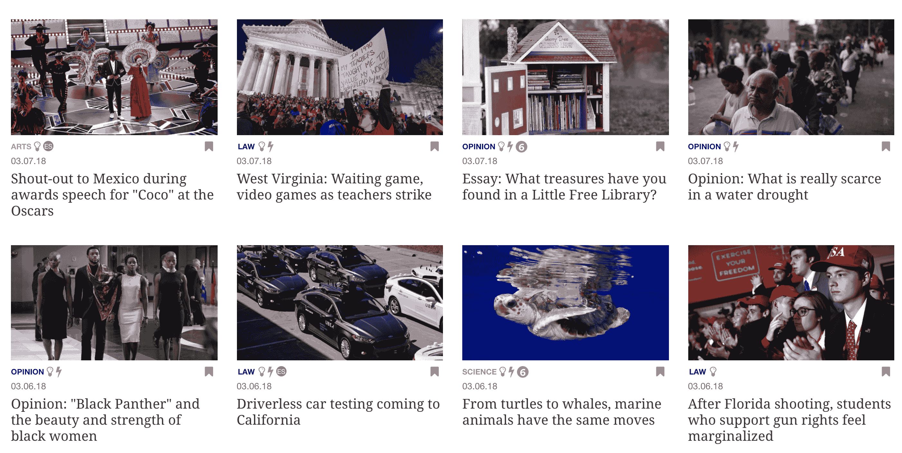
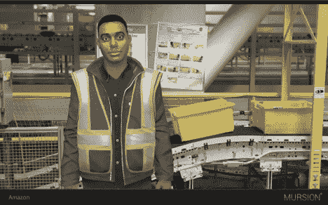

# 虚拟现实、增强现实和社交媒体等移情技术可以改变教育 

> 原文：<https://web.archive.org/web/https://techcrunch.com/2018/04/22/empathy-technologies-like-vr-ar-and-social-media-can-transform-education/?utm_source=sniply&utm_campaign=sniply&utm_medium=sniply>

詹妮弗·卡罗兰撰稿人

More posts by this contributor

在《T4》*《我们天性中的美好天使》* 中，哈佛大学心理学家史蒂芬·平克认为阅读是一种“换位思考的技术”,它不仅能够唤起人们的共鸣，还能扩大这种共鸣。“文化的力量”，正如他所说，“让人们习惯于偏离他们狭隘的观点”，同时“为道德价值和社会秩序的新思想创造了一个温室。”

第一个主要的移情技术是古滕贝格在 1440 年发明的印刷机。随着书籍的大量生产，出现了广泛的读写能力和占据他人思想的能力。虽然这听起来很老套，但对于前工业时代的人们来说，这实际上是一个地震般的创新，他们看不到、听不到或无法与村外的人互动。最近，电视和虚拟现实等其他技术取得了进一步的进展，利用更多的感官来加深模拟的人类体验。

我们现在正处于移情技术的另一个突破的风口浪尖，这一突破源于教育。同理心技术扩大了我们对各种文学的接触，让我们更深入地了解彼此，并为跨越种族、文化、地理和阶级背景的有意义的合作创造机会。新的移情技术不会让思想的多样性碰运气；更确切地说，他们有意为之而建。

对这些工具的需求来自学校和企业环境中的教育工作者，他们肩负着成功协作的使命。处于这种日益多样化前沿的教师认为，帮助学生和员工成为更好的换位思考者是他们的工作。

我们对扩大同理心圈子的需求从未像现在这样迫切。作为一个国家，我们正变得日益多样化、隔离和孤立。

2020 年的高中毕业班将是少数民族占多数，收入不平等的加剧已经造成了巨大的收入和机会差距。我们的社区已经倒退到更高的社会经济隔离水平；轨道两边的家庭越来越相互隔绝。

这些新的同理心技术与社交媒体平台非常不同，社交媒体平台曾经充满希望将我们所有人连接在一个在线乌托邦中。现实是，社交媒体让我们走向了相反的方向。相反，我们的平台让我们陷入了自己社会过滤器的回音室，很少接触到新的视角。

不仅仅是社交媒体。点击诱饵小报新闻鼓励嘲讽和判断，而不是像托尼·莫里森或唐娜·塔特这样的伟大作品的移情建设之旅。在文学的丰富深度中，我们与主角感同身受，当他们的缺陷不可避免地暴露出来时，我们会感到谦卑，并在他们复杂、不完美的生活中看到自己。研究已经证明，那些读更多文学小说的人更善于发现和理解他人的情感。

接下来是几个移情技术在实体学校、在线和企业学习中的例子。

同理心技术增强了人与人之间的联系，而不是取代它。 [Outschool](https://web.archive.org/web/20221209005040/https://outschool.com/#abjgbaian9) 是一个在线直播课程的市场，它通过视频聊天将 K-12 学生和教师分成小组，以探索共同的兴趣。从历史上看，在线学习提供了很大的选择和机会，但这是以学生参与和人际关系为代价的。

Outschool 使用实时视频聊天和小组形式消除了这种权衡的必要性。孩子们和老师能看到和听到彼此，像在学校教室里一样实时互动，但参与者来自世界各地和不同的背景。

校外实时视频聊天

有意识地管理多样化的内容库是新移情技术和社交媒体之间的一个关键区别。 [Newsela](https://web.archive.org/web/20221209005040/https://newsela.com/) 是一个新闻平台，每天向课堂提供大量精选的分级内容。它是陈腐、单一来源教科书的解药，十年更新一次。在下面的截图中，孩子们接触到了关于墨西哥、枪支权利和黑人女性的故事。教师经常使用纽塞拉的文章作为丰富课堂讨论的起点，在这里教授和练习尊重他人的话语技巧。

纽塞拉的界面。

企业领导人越来越多地将同理心作为一种关键的领导特质，并在他们自己的企业领导和日常员工教育计划中使用这些技术。谷歌的桑德尔·皮帅将他的管理风格描述为“超越工作并与他人良好合作的能力”微软的塞特亚·纳德拉认为，同理心是商业创新的关键源泉，也是一个人“抓住客户未满足的、未表达的需求”的能力的先决条件。”优步的新任首席执行官达拉·科斯罗萨西和苹果公司的蒂姆·库克组成了一批领导者，他们首先是听众，与刻板而傲慢的硅谷首席执行官形成鲜明对比。

为了加深员工的同理心，像亚马逊这样的尖端公司正在使用像 [Mursion](https://web.archive.org/web/20221209005040/https://mursion.com/) 这样的虚拟环境来练习富有挑战性的人际互动。Mursion 的虚拟模拟由训练有素的人类演员提供动力，他们与员工进行实时对话。我试着扮演一个经理和一个正在努力保住两份兼职工作的一线工人讨论强制加班的角色。这位生产线工人向我描述了最后一分钟的加班请求如何打乱了他的日程安排，使他的第二份工作陷入危险，并影响了他的育儿状况。

对于 Mursion 和 Newsela 来说，建立共鸣是产品的有意结果。它们被部署在学习环境中，训练有素的教育者可以将它们用作脚手架工具。使用 Mursion，员工可以练习艰难的对话，并从他们的辅导员和同事那里获得反馈。有了 Newsela，老师们可以把枪支权利的文章作为一个丰富的促进小组讨论的出发点。

 **更广泛的科技行业可以从教育工作者采用同理心技术中获得的是，讲故事、提升人类状况的共同元素以及采取以人为本的方法来制造产品将有助于我们打破我们狭小的回音室，并通过这样做来丰富我们自己的生活。**