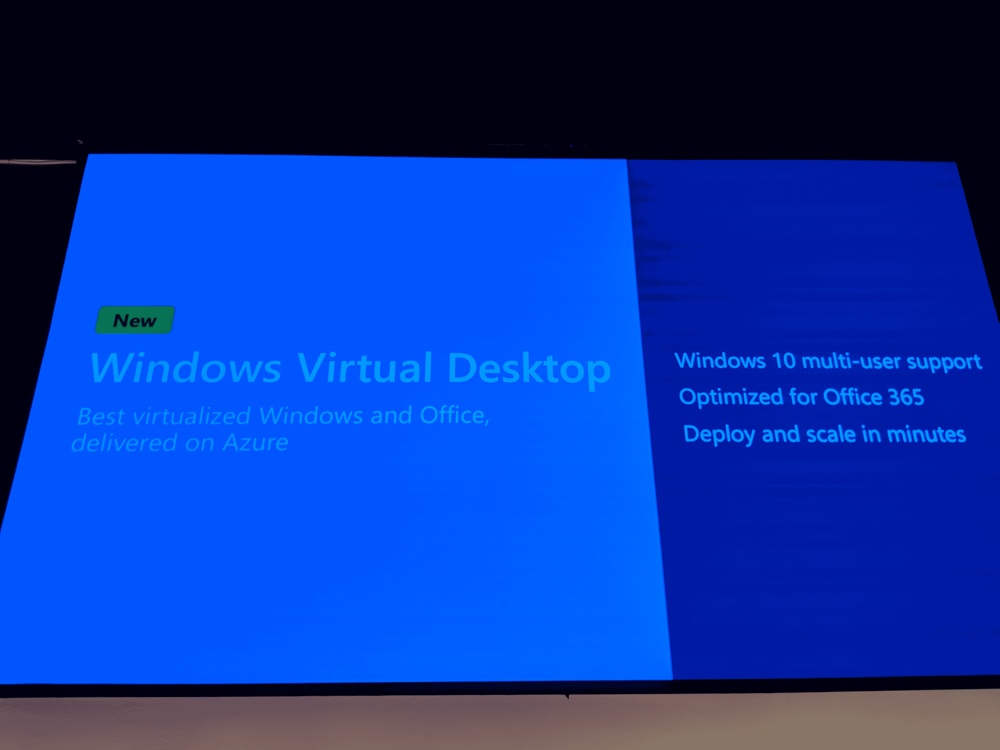
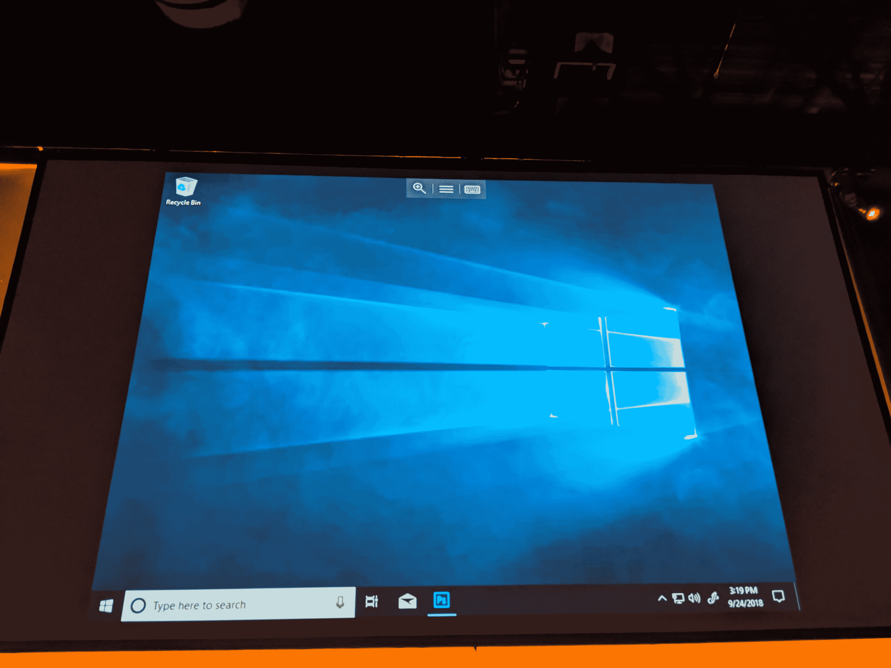

# 微软新的 Windows 虚拟桌面让您可以在云端运行 Windows 10 

> 原文：<https://web.archive.org/web/https://techcrunch.com/2018/09/24/microsofts-new-windows-virtual-desktop-lets-you-run-windows-10-in-the-cloud/?utm_source=tcfbpage&sr_share=facebook>

# 微软新的 Windows 虚拟桌面可以让你在云中运行 Windows 10

在云中运行 Windows 桌面有很多第三方解决方案，但直到现在，微软自己似乎也不愿意提供同样的用户体验。然而，今天，[公司宣布了](https://web.archive.org/web/20221206185249/https://www.microsoft.com/en-us/microsoft-365/blog/2018/09/24/microsoft-365-adds-modern-desktop-on-azure/) [Windows 虚拟桌面](https://web.archive.org/web/20221206185249/https://www.microsoft.com/en-us/microsoft-365/modern-desktop/enterprise/windows-virtual-desktop)，这是一种新的基于 Azure 的服务，在 Azure 上提供完全虚拟化的多用户 Windows 10 体验，以及 Office 365 ProPlus。

微软表示，Azure 上的 Windows 10 将提供对微软商店和企业为用户编写的常用业务应用程序的访问。微软还指出，它希望在这里建立一个更大的生态系统，Citrix、CloudJumper、FSLogix、Lakeside Software、Liquidware、People Tech Group 和 ThinPrint 已经在进行集成。

该服务还将包括免费的 Windows 7 扩展安全更新。我不太清楚为什么要把它和虚拟化的 Windows 10 桌面放在一起，但事实就是如此。很有可能，微软正在利用这一优惠让更多的 Windows 7 用户转向更现代的操作系统。

微软还表示，在 Azure 和 Office 上部署和扩展 Windows 只需几分钟，桌面将具备用户所期望的所有内置安全和合规功能。

在一次演示中，微软展示了这些虚拟化桌面如何利用硬件设备，如带有触摸功能的微软 Surface，以及通过内置麦克风访问 Cortana。

该服务将向 Windows 10 企业和教育客户提供。他们将能够使用他们的 Azure 订阅来部署这些桌面，唯一的额外成本将是存储和虚拟机本身。如果他们计划长时间使用这些桌面，保留实例是一个不错的选择。

可悲的是，微软还没有提供任何其他技术细节，但我们会更新这个帖子，一旦我们听到更多。

