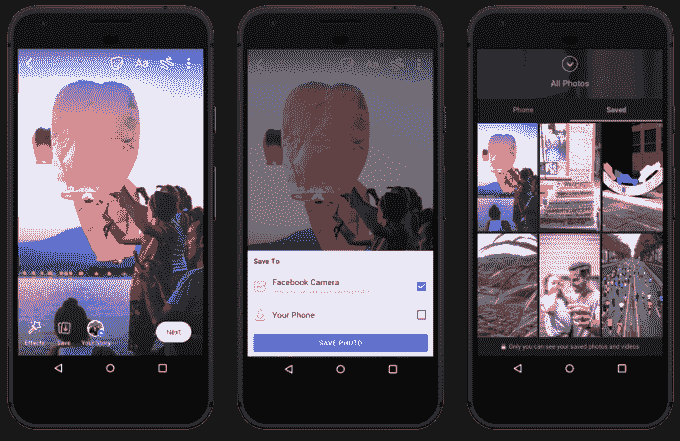

# 脸书故事揭示了 1.5 亿每日观众，广告来了 

> 原文：<https://web.archive.org/web/https://techcrunch.com/2018/05/17/facebook-stories-150-million-users/?zd_source=mta&zd_campaign=11856&zd_term=merilynpereira>

自[发布](https://web.archive.org/web/20221208102434/https://techcrunch.com/2017/03/28/storybook/)以来，经过 14 个月的沉寂，脸书故事终于宣布其 Snapchat Stories 克隆版的日活跃用户数达到 1.5 亿。现在是时候从中赚点钱了。脸书故事将于今天开始在美国、墨西哥和巴西测试其首批广告。

它们是 5 到 15 秒的视频广告，用户可以跳过，虽然现在没有点击或行动号召，但脸书计划在未来几个月内添加这一功能。广告商可以轻松地将他们的 Instagram Stories 广告扩展到这个新的表面，或者让脸书自动将他们的新闻订阅广告重新格式化，在底部添加颜色匹配的边框和文本。脸书还计划给商家更多关于他们的故事表现的指标，以说服他们这个功能值得他们的广告费用。

广告商可以将他们的 Instagram Stories 广告扩展到脸书故事(左)，或者让脸书将他们的新闻订阅广告重新格式化，在底部显示颜色匹配的图像边框和广告文本

脸书不得不钉故事广告来保护它的业务，因为首席新闻官克里斯考克斯本月表示，[故事将在明年的某个时候超过 feed 帖子，成为分享](https://web.archive.org/web/20221208102434/https://techcrunch.com/2018/05/02/stories-are-about-to-surpass-feed-sharing-now-what/)的最佳方式。首席执行官马克·扎克伯格警告说，脸书必须确保“故事中的广告和提要中的广告一样好。如果我们做得不好，那么随着更多的分享转向故事，这可能会损害我们的业务。”尽管有人批评这一功能对于 Instagram 故事来说过于突兀和多余，但脸书证明了这种短暂的幻灯片形式是无法改变的。Snapchat 可能会看到广告支出转移到脸书，特别是因为蓝色巨人社交网络有这么多关于我们的目标数据。

## 讲故事者的竞赛

我的第一个问题是脸书如何定义故事的每日用户。任何在脸书的应用程序或网站上看新闻的人都可以。这很有用，因为这意味着它没有计算那些简单地将自己的故事从 Instagram 或 Messenger 交叉发布到脸书的用户，这将夸大数字。这证明了 Instagram 开创的、脸书带来的顶端故事设计的强制力，它已经在[测试更大的故事预览瓷砖](https://web.archive.org/web/20221208102434/https://techcrunch.com/2018/04/05/facebook-stories-default/)。

作为背景，以下是顶级玩家的每日故事用户数和每月总用户数的细分，按大小排序:

1.  **WhatsApp 现状:**截至 2018 年 5 月，每月 15 亿中，每日 4.5 亿
2.  **Instagram 故事:**截至 2017 年 11 月，每月 8 亿条新闻中，每日 3 亿条
3.  **Snapchat(全 app):** 截至 2018 年 5 月日活 1.91 亿，上线
4.  **脸书故事:**截至 2018 年 5 月，每日 1.5 亿，每月 22 亿
5.  **信使日/故事:**截至 2017 年 9 月，每月 13 亿人中有 7000 万人

Instagram Stories 在达到 1.5 亿用户时也开始显示广告，尽管这只是推出后的五个月，而脸书故事花了 14 个月才达到这一水平。

脸书未来参与度增长的真正机会是将 Stories 格式引入国际市场【that Snapchat 四年来基本上忽视了这个市场,直到最近才通过重新设计其 Android 应用程序来认真对待这个市场。WhatsApp 利用 Snap 对美国青少年的关注，凭借全球年轻人的支持，迅速成为头条新闻产品。现在，脸书正在专门为印度等国家开发 Stories 功能，比如帮助非母语键盘用户的新音频帖子，以及云存储，这样你就可以私下将照片和视频保存到脸书，供那些手机上没有空间的人使用。

脸书故事让你不用 360 度相机就可以用这个很酷的“用镜头绘画”界面拍摄 360 度照片

自 2017 年 1 月测试并于 2017 年 3 月推出以来，脸书一直在快速迭代其版本的故事，希望使其更独特，更适合观众。这包括从其其他应用程序和一个[桌面界面](https://web.archive.org/web/20221208102434/https://techcrunch.com/2018/01/18/facebook-stories-here-to-stay/)添加[交叉发布](https://web.archive.org/web/20221208102434/https://techcrunch.com/2017/11/13/rip-direct-and-messenger-day/) [，高级快门格式如](https://web.archive.org/web/20221208102434/https://beta.techcrunch.com/2017/10/04/instaface/?_ga=2.100168670.1357685716.1526299415-1361550980.1392837599)[回飞棒](https://web.archive.org/web/20221208102434/https://techcrunch.com/2018/04/12/facebook-3d-drawing/)和新的增强现实功能如 [3D 涂鸦](https://web.archive.org/web/20221208102434/https://techcrunch.com/2018/04/12/facebook-3d-drawing/)和真实世界 QR 和[图像触发器](https://web.archive.org/web/20221208102434/https://techcrunch.com/2018/03/09/facebook-launches-ar-effects-tied-to-real-world-tracking-markers/)将 AR 锚定到一个位置。

哦，我们还发现了一个未公布的额外功能。脸书故事现在可以在没有 360°相机的情况下拍摄 360°照片。它使用了一个很酷的界面，告诉你在你周围的什么地方“画”你的相机，所以不像你只能拍一张全景照片，你可以回去补上错过的地方。

## Snap 被打败了；赚钱的时候到了

脸书的所有努力似乎都得到了回报。Snapchat 陷入了有史以来最慢的日用户增长率，上个季度仅为 2.13%，而更加饱和的脸书增长了 3.42%。三月份，Snapchat 的用户数量实际上减少了。

这可能是脸书开始在故事中植入广告所需要的信号。它有效地击败了 Snapchat。没有如此强大的竞争对手，脸书有更多的余地用广告来污染用户体验。与此同时，Snapchat 在 Q1 的收入低于预期，亏损高达 3.85 亿美元，迫切希望提高广告销售额。

“故事中的广告为 Instagram 上的企业增加了很多价值，我们相信我们也能在脸书、 脸书 p 产品经理佐赫布·哈吉亚尼告诉我。“确保这是产品使用者的良好体验将是我们的首要任务。”脸书已经安排了一些广告测试合作伙伴，但没有透露，但也将为 Oculus inside Stories 运营自己的广告。

由于现有的脸书和 Instagram 广告客户能够轻松地将他们的广告移植到脸书故事，以及更大的总覆盖范围，他们可能不会在 Snap 上做广告，除非他们寻求青少年。事实上，故事可以解决脸书在关闭侧边栏单元的同时耗尽新闻提要广告空间的问题。故事可以产生广告库存，这是将更多营销推向社交网络所需要的。

故事不可避免。Snapchat 于 2013 年 10 月首次推出这种模式，脸书用了近三年时间才意识到这种模式对该公司构成了生存威胁。但随着 Instagram 克隆版的迅速成功，脸书明智地收起了骄傲，将其应用转向这种视觉交流风格。这是另一个时刻，就像转向手机一样，脸书可能会踌躇不前。但是愿意承认错误和无情竞争可能会赢得另一个社会统治时代。

要了解更多故事，请查看我们的专题报道: